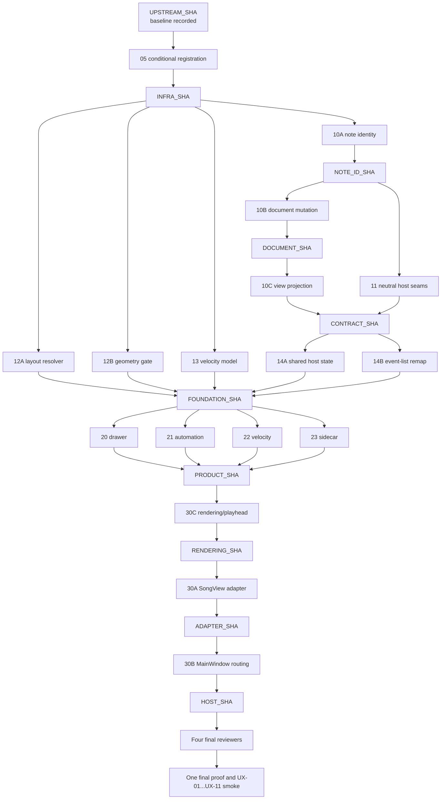

# PSG velocity-history reimplementation DAG

## Authority and supersession

This is the active execution DAG for
[`docs/EDITOR_DRAWER_REIMPLEMENTATION.md`](docs/EDITOR_DRAWER_REIMPLEMENTATION.md).
The executable packets are exclusively in
[`plans/psg-velocity-history/`](plans/psg-velocity-history/).

`plans/editor-drawer/` is historical only. It MUST NOT select work, establish a
base, assign an agent, set verification cadence, or approve implementation.
The specification remains normative for behavior, acceptance IDs, manual UX
checks, and exclusions. The fresh upstream source establishes existing
interfaces and style; oracle `52fd478f27594ffe410472fb8d4a62e792378f16` is UX
evidence only and MUST NOT be ported, merged, cherry-picked, or copied.


## Bases, prerequisites, and immutable milestones

The coordinator fetches and records
`UPSTREAM_SHA = 59c80026b3fad9419241f971112e20d1954587ff`. It pins the
`hearth-test` fixture revision, makes a scratch fixture with isolated settings,
and runs and records the upstream roll baseline **before any implementation**.
That retained baseline is the sole attribution reference for later failures.

The integration branch is `feature/psg-velocity-history-upstream`. Plan/spec
documentation may be ordinarily merged there and recorded as `PLAN_SHA`, but
that documentation commit MUST NOT replace `UPSTREAM_SHA` as the source
comparison or source-task base.
The absolute runtime/worktree root is
`/Users/spencer/dev/cProjects/porydaw/.worktrees/psg-velocity-history-upstream`.
Its integration worktree is
`/Users/spencer/dev/cProjects/porydaw/.worktrees/psg-velocity-history-upstream/integration/`;
every named relative worktree below is an immediate child of that runtime root.
No task executes from this documentation checkout.

All worktree creation/reset, branch creation, ref-base verification, and submodule initialization/verification operations are assigned exclusively to `git-operations-runner`. Packet `task` agents enter prepared worktrees and commit implementation. The coordinator performs ordinary merges of approved heads.

| Milestone | Meaning | Permitted use as a base |
| --- | --- | --- |
| `UPSTREAM_SHA` | Fresh fetched upstream commit and retained baseline source. | Packet 05 only. |
| `PLAN_SHA` | Documentation-only integration commit. | Never a source-task base. |
| `INFRA_SHA` | Reviewed ordinary merge of packet 05. | Every implementation root starts here. |
| `NOTE_ID_SHA` | Reviewed ordinary merge of 10A. | 10B and 11 only. |
| `DOCUMENT_SHA` | Reviewed ordinary merge containing 10B and its `SongDocument`-minted identities. | 10C only. |
| `CONTRACT_SHA` | Reviewed ordinary integration containing 10C and 11 after `DOCUMENT_SHA`. | 14A and 14B only. |
| `FOUNDATION_SHA` | Reviewed ordinary merge of 12A, 12B, 13, 14A, and 14B. | Packets 20–23 only. |
| `PRODUCT_SHA` | Reviewed ordinary merge of packets 20–23. | 30C only. |
| `RENDERING_SHA` | Reviewed ordinary merge of 30C rendering/playhead from `PRODUCT_SHA`. | 30A only. |
| `ADAPTER_SHA` | Reviewed ordinary merge of 30A SongView adapter/lifecycle from `RENDERING_SHA`. | 30B only. |
| `HOST_SHA` | Reviewed ordinary merge of 30B MainWindow routing/persistence from `ADAPTER_SHA`, followed by the aggregate host proof. | Final review candidate. |

Packet 05 is an infrastructure prerequisite, not a late host concern. `git-operations-runner` creates its worktree `05-check-registration/` and branch `task/psg-velocity/check-registration` from `UPSTREAM_SHA` and verifies submodules. Its `task` agent enters the prepared worktree and owns exactly:

1. `CMakeLists.txt`;
2. `src/main.cpp`; and
3. new `src/editorcheckdispatch.h.in`.

Packet 05 conditionally registers a new-module command only when that module's
genuinely new sentinel check/source file exists. It MUST NOT use a complete set
of paths that already exists in fresh upstream source as a completion
predicate. A matching sentinel adds its group sources, compile definition, and
module-specific command while keeping the upstream-only build unchanged.
Existing-source work extends its existing edit, roll, event-list, or theme
harness and invokes that existing command; it receives no packet-05
`EXISTS`-based registration. The coordinator runs packet 05's focused
registration proof once from the committed packet-05 head, whose source set is
otherwise upstream-only; `UPSTREAM_SHA` is the comparison base, not the tree
rebuilt for that proof. The proof configures/builds that head and exercises its
generated-header no-sentinel fallback: every conditional-manifest spelling is
recognized but has no enabled conditional runner and returns deterministic
nonzero `unavailable` without launching the GUI; non-manifest arguments retain
normal startup. A `reviewer` inspects its committed `UPSTREAM_SHA..HEAD` range,
and its ordinary merge records `INFRA_SHA`.

`git-operations-runner` prepares and verifies every worktree, branch, ref base, and submodule state. Every implementation task agent (`task`) enters its prepared worktree, owns its listed paths, makes ordinary buildable commits, and hands off its branch head. Implementation agents author code and focused checks but MUST NOT create, reset, or rebase worktrees, and MUST NOT run builds, tests, formatters, or linters. The coordinator alone runs each completed wave's focused command batch once; a reviewer inspects the committed range from the named base to the submitted head. The coordinator merges only approved heads ordinarily: no staged-tree handoff, synthesized candidate, transport commit, cherry-pick, rebase, or rewrite.

## Accepted DAG



The documented dependency and named base govern execution, not wall-clock
order. `12A`, `12B`, and `13` may proceed in parallel from `INFRA_SHA` while
the identity chain proceeds as 10A, then parallel 10B/11, then 10C from
`DOCUMENT_SHA`. `DOCUMENT_SHA` must contain the real IDs minted by
`SongDocument` in 10B before 10C can project them into `ViewNote`. Their
approved heads wait for the foundation assembly gate. No product branch exists
before `FOUNDATION_SHA`; the host chain then starts only with 30C from
`PRODUCT_SHA`, followed by 30A from `RENDERING_SHA` and 30B from `ADAPTER_SHA`.

## Worktree, branch, and ownership map

Every implementation packet owns the explicit three-to-five paths below. No
path is duplicated within a concurrent wave. A sequential descendant may touch
an ancestor-owned host/harness path only where this plan explicitly assigns the
later owner.

| Packet | Agent | Worktree / branch | Base | Exclusive paths and contract |
| --- | --- | --- | --- | --- |
| 10A note identity transport | `task` | `10a-note-identity/` / `task/psg-velocity/note-identity` | `INFRA_SHA` | `src/core/noteid.h`, `src/core/smf.h`, `src/core/miditimeline.h`, `src/core/miditimeline.cpp`, `src/noteidcheck.cpp` (new sentinel). Mint only opaque transient `NoteId` later in `SongDocument`; carry note-on identity into `TimelineEvent`; do not affect MIDI serialization or equality. |
| 12A layout resolver | `task` | `12a-layout-resolver/` / `task/psg-velocity/layout-resolver` | `INFRA_SHA` | `src/ui/layout.h`, `src/ui/layout.cpp`, `src/ui/theme/themecheck.h`, `src/ui/theme/themecheck.cpp`, `src/ui/theme/themechecks_main.cpp`. Own semantic resolver values and clean-process base-font 12/16 checks. |
| 12B geometry gate | `task` | `12b-layout-gate/` / `task/psg-velocity/layout-gate` | `INFRA_SHA` | `tools/check_editor_layout_geometry.py`, `tools/check_editor_layout_geometry_test.py`, `tools/check_editor_layout_geometry_fixtures.py`. Own the repository source audit, its narrow self-test/fixtures, focused file arguments, and a default final target set; do not migrate call sites. |
| 13 velocity model | `task` | `13-velocity-model/` / `task/psg-velocity/velocity-model` | `INFRA_SHA` | `src/core/psgvelocitymodel.h`, `src/core/psgvelocitymodel.cpp`, `src/ui/velocityaxis.h`, `src/ui/velocityaxis.cpp`, `src/psgvelocitymodelcheck.cpp`. |
| 10B document mutation | `task` | `10b-document-contracts/` / `task/psg-velocity/document-contracts` | `NOTE_ID_SHA` | `src/core/songdocument.h`, `src/core/songdocument.cpp`, `src/editcheck.cpp` (existing harness). Assign/preserve IDs, find by ID, revision, atomic revision-checked `setNotesVelocities`, and complete `TrackRemap`. |
| 11 neutral host seams | `task` | `11-host-seams/` / `task/psg-velocity/host-seams` | `NOTE_ID_SHA` | `src/ui/editorviewstate.h`, `src/ui/editorviewstate.cpp`, `src/ui/editorpage.h`, `src/ui/editorpagehost.h` (which contains `EditorPageContext` and the sole static `uint64_t EditorPageContext::drawerContextTick(double)` helper), `src/editorviewstatecheck.cpp` (new sentinel). `EditorPageContext::drawerContextTick(double)` returns `floor(max(0, t) + 0.5)` as a `uint64_t` tick and is covered there. `EditorViewState` is typed persistent cosmetic state only; runtime selection, timeline, voice, and document state remain in context/host. Consume existing `TimelineSurface`; do not edit SongView, TimelineSurface, PlayheadOverlay, AutomationPage, MainWindow, CMake, or main. |
| 10C view projection | `task` | `10c-note-projection/` / `task/psg-velocity/note-projection` | `DOCUMENT_SHA` | `src/ui/songviewmodel.h`, `src/ui/songviewmodel.cpp`, `src/rollcheck.cpp` (existing harness). Propagate `NoteId` into `ViewNote` and characterize duplicate notes. |
| 14A shared host selection/remap | `task` | `14a-shared-host-state/` / `task/psg-velocity/shared-host-state` | `CONTRACT_SHA` | `src/ui/songview.h`, `src/ui/songview.cpp`, `src/rollcheck.cpp` (existing harness). Replace tick/key selection with shared opaque `NoteId`; migrate only cosmetic values to `EditorViewState`; retain runtime-derived fields as live SongView state. Preserve `SongView::ViewState` as a compatible capture/apply snapshot DTO, not live authority, so fresh MainWindow/ViewSidecar callers remain buildable. Consume complete `TrackRemap` for selected track, multi-track scope, mute/solo, and other SongView state without changing behavior. |
| 14B event-list remap | `task` | `14b-event-list-remap/` / `task/psg-velocity/event-list-remap` | `CONTRACT_SHA` | `src/ui/eventlistview.h`, `src/ui/eventlistview.cpp`, `src/eventviewcheck.cpp` (existing harness). Consume complete SMF-chunk remap for anchoring on apply/Undo/Redo and remove the move-only route. |
| 20 drawer | `task` | `20-drawer/` / `task/psg-velocity/drawer` | `FOUNDATION_SHA` | `src/ui/editordrawer.h`, `src/ui/editordrawer.cpp`, `src/rollcheckdrawer.cpp`. Drawer shell only: overlay, tabs, resize, local page/visibility state, and focus-facing behavior; never edit a song. |
| 21 automation | `task` | `21-automation/` / `task/psg-velocity/automation` | `FOUNDATION_SHA` | `src/ui/automationpage.h`, `src/ui/automationpage.cpp`, `src/ui/automationarea.h`, `src/ui/automationarea.cpp`, `src/rollcheckautomation.cpp`. Own page/area behavior, gestures, remap consumption, Undo, drawing, and focused proof. |
| 22 velocity | `task` | `22-velocity/` / `task/psg-velocity/velocity` | `FOUNDATION_SHA` | `src/ui/velocitypage.h`, `src/ui/velocitypage.cpp`, `src/ui/velocityarea.h`, `src/ui/velocityarea.cpp`, `src/rollcheckpsgvelocity.cpp`. Own shared-selection consumption, continuous/intrinsic interaction, gestures, accessibility, lifecycle/content caching, and proof; consume but do not modify the model/axis. |
| 23 sidecar | `task` | `23-sidecar/` / `task/psg-velocity/sidecar` | `FOUNDATION_SHA` | `src/ui/viewsidecar.h`, `src/ui/viewsidecar.cpp`, `src/viewsidecarcheck.cpp`. Serialize and harden the detached `SongView::ViewState` snapshot DTO plus cosmetic `EditorViewState` with typed validation and unknown-key preservation; neither is live authority. No UI, host, remap, drawing, or gesture work. |
| 30C rendering/playhead | `task` | `30c-host-rendering/` / `task/psg-velocity/host-rendering` | `PRODUCT_SHA` | `src/ui/timelinesurface.h`, `src/ui/timelinesurface.cpp`, `src/ui/playheadoverlay.h`, `src/ui/playheadoverlay.cpp`, `src/renderingplayheadcheck.cpp` (new sentinel). Dynamic timeline-band API, overlay-only steady playback, and content diagnostics/invalidation boundaries. |
| 30A SongView adapter/lifecycle | `task` | `30a-host-songview/` / `task/psg-velocity/host-songview` | `RENDERING_SHA` | `src/ui/songview.h`, `src/ui/songview.cpp`, `src/hostcheck.cpp` (new sentinel). Construct modules and shared context/callbacks; forward revisioned velocity updates exactly, including no-op and stale results; route lifecycle/focus/sidecar state and request dynamic bands. This is the permitted sequential descendant of 14A's SongView paths. |
| 30B MainWindow routing/persistence | `task` | `30b-host-mainwindow/` / `task/psg-velocity/host-mainwindow` | `ADAPTER_SHA` | `src/mainwindow.h`, `src/mainwindow.cpp`, `src/tabcheck.cpp`, `src/sessioncheck.cpp`, `src/mainwindowroutingcheck.cpp` (new sentinel). Active-tab A/V, event-list blocking, close/project/song/app save boundaries, focus, and status. |

## Packet-05 registration and existing-harness map

`EXISTS` predicates are limited to groups with a source-grounded, genuinely new
sentinel: 10A uses `src/noteidcheck.cpp`; 11 uses
`src/editorviewstatecheck.cpp`; and 30A, 30B, and 30C use respectively
`src/hostcheck.cpp`, `src/mainwindowroutingcheck.cpp`, and
`src/renderingplayheadcheck.cpp`. The 30B and 30C sentinels enable their
individual registered commands; the aggregate host command is registered only
when all three host sentinels are present. The other new-module groups likewise
use their new dedicated source, never a pre-existing production/harness set.
The exact host commands are:

```text
<porydaw> --check-host-adapter <scratch-project> <song-label>
<porydaw> --check-mainwindow-routing <scratch-project> <song-a> <song-b>
<porydaw> --check-rendering-playhead <scratch-project> <song-label> [screenshot]
<porydaw> --check-host-integration <scratch-project> <song-a> <song-b> [screenshot]
```
The [packet-05 Runner declaration column](plans/psg-velocity-history/05-check-registration.md#conditional-executable-groups)
is authoritative for every conditional command's exact `int run...` symbol and
signature; independent module agents MUST implement no alternate declaration.
Those declarations pass every `QString` as `const QString &` and give an
optional `screenshotPath` its `QString()` default only at the declaration. The
aggregate declaration is
`runHostIntegrationCheck` in 30B's `src/mainwindowroutingcheck.cpp`; it is
declared/dispatched only with all three host macros and is one integrated
runner, never sequential aliases of the individual host checks.

10B extends `src/editcheck.cpp`; 10C and 14A extend `src/rollcheck.cpp`; 14B
extends `src/eventviewcheck.cpp`; and 12A extends the existing theme checks.
These are existing commands, not packet-05 registrations. At the respective
completed subwave the coordinator invokes each applicable command once, never
once per task and again for the same head:
`<porydaw> --editcheck <scratch-project>`,
`<porydaw> --rollcheck <scratch-project> mus_lovely <roll-screenshot>`, and
`<porydaw> --eventviewcheck <scratch-project> mus_lovely <event-screenshot>`,
plus the existing `porydaw_themechecks` layout commands. The final layout
commands remain exactly:

```text
QT_QPA_PLATFORM=offscreen <build>/porydaw_themechecks --editor-layout-check --base-font-px 12
QT_QPA_PLATFORM=offscreen <build>/porydaw_themechecks --editor-layout-check --base-font-px 16
```

## Foundation mini-DAG and product/host waves

### Foundation

From `INFRA_SHA`, start 10A, 12A, 12B, and 13 in parallel. The coordinator
runs each completed subwave's applicable focused command once and reviewers
inspect their named-base commit ranges. Only an approved ordinary merge of 10A
records `NOTE_ID_SHA`.

From `NOTE_ID_SHA`, run 10B and 11 in parallel. Merge approved 10B normally
and record the resulting integration commit containing its real
`SongDocument`-minted identities as `DOCUMENT_SHA`; 11 may complete in the
same interval. Run 10C only from `DOCUMENT_SHA`, so its `ViewNote` projection
receives those real IDs. Once 10C and 11 are approved and normally present on
integration, record `CONTRACT_SHA`.

From `CONTRACT_SHA`, run 14A and 14B in parallel. After their focused commands
and parallel review, merge their approved heads together with the already
reviewed 12A, 12B, and 13 heads. The resulting ordinary integration commit is
`FOUNDATION_SHA`, the sole foundation assembly point.

### Product wave

Packets 20–23 run independently and concurrently from exactly
`FOUNDATION_SHA`. Each uses its packet-05 conditional module command and does
not edit an ancestor contract. After all four commits are ready, the coordinator
runs those four focused commands once in parallel, dispatches four independent
`reviewer` agents, ordinarily merges approved heads, and records `PRODUCT_SHA`.

### Serial host integration chain

The host packets retain exclusive paths; CMake and main remain packet 05 paths.
Their fixed cross-contract is:

- 30C exposes a generic dynamic-band update API.
- 30A supplies current roll/visible-page bands and never paints playhead
  content.
- 30B calls only public SongView drawer/persistence methods.

Creation and verification of host worktrees at their serial exact bases are assigned to `git-operations-runner`. `git-operations-runner` creates and verifies the `30c-host-rendering` worktree and branch from exact `PRODUCT_SHA`, including submodule initialization and verification, before handing off to 30C's implementation agent. 30C's implementation `task` agent authors code and focused checks in that prepared worktree, but does not create, reset, or rebase a worktree. The coordinator builds/checks 30C's enabled individual command once on its committed head from that base; a reviewer then inspects `PRODUCT_SHA..30C_HEAD`. Only after approval does its ordinary merge record `RENDERING_SHA`.

`git-operations-runner` then creates and verifies the `30a-host-songview` worktree and branch from exact `RENDERING_SHA`, including submodule verification, before handing off to 30A's implementation agent. 30A's implementation `task` agent authors code and focused checks in that prepared worktree. The coordinator builds/checks 30A's enabled individual command once on its committed head from that base; a reviewer then inspects `RENDERING_SHA..30A_HEAD`. Only after approval does its ordinary merge record `ADAPTER_SHA`.

`git-operations-runner` then creates and verifies the `30b-host-mainwindow` worktree and branch from exact `ADAPTER_SHA`, including submodule verification, before handing off to 30B's implementation agent. 30B's implementation `task` agent authors code and focused checks in that prepared worktree. The coordinator builds/checks 30B's enabled individual command once on its committed head from that base; a reviewer then inspects `ADAPTER_SHA..30B_HEAD`. Only after approval does its ordinary merge record `HOST_SHA`. The coordinator then runs the single aggregate `porydaw --check-host-integration` proof on that integrated `HOST_SHA`, including the **CORE-03** forwarding recheck, before it is a final review candidate. No implementation task agent creates, resets, or rebases a worktree.

## Review, validation, geometry, and final repair flow

Task agents commit implementation and focused checks; reviewers inspect
committed ranges and contracts; the coordinator alone runs focused validation
once after each completed wave. A focused proof is evidence for that wave, not
a replacement for review or UX inspection. The final native matrix and visible
smoke run exactly once per approved candidate SHA—including an approved repair
candidate—and never per module or reviewer.

12A owns resolver checks and 12B owns the checker/self-test. Product and host
waves exercise only their module's focused geometry/hit-test behavior through
registered commands. They MUST NOT run a repository-wide geometry source scan.
Only the final packet runs the two clean-process resolver commands (base fonts
12 and 16) and the default repository-wide `check_editor_layout_geometry.py`
audit once on the integrated candidate; this preserves final **LAY-01** proof.

From `HOST_SHA`, dispatch four `reviewer` agents in parallel for: drawer and
persistence; automation; velocity and accessibility; and rendering and
ownership. Every report starts with exactly `APPROVED <CANDIDATE_SHA>` or
`CHANGES_REQUESTED <CANDIDATE_SHA>`. Its traceability body follows: approvals
list normative IDs and evidence; changes-requested reports additionally state
the precise observable failure or source location and narrow repair owner. All
four approvals must name that identical candidate SHA.

A finding starts `repair/psg-velocity/<owner>/<candidate-short>` from the
rejected candidate. `git-operations-runner` creates and verifies every repair
branch and worktree from that exact rejected candidate SHA, including submodule
initialization and verification. The exclusive owner’s `task` implementation
agent commits implementation code and focused checks in that prepared worktree
without creating, resetting, or rebasing worktrees; the coordinator runs only
the affected focused command(s) or direct-file check(s), each once; a focused
reviewer approves; and the coordinator merges normally. A candidate rejected before four
same-SHA final approvals receives no final matrix or smoke. A post-approval
failure during its one proof remains recorded against that candidate, then
follows this repair route. The replacement integration SHA becomes a new
candidate and **all four** final reviewers rerun against it. Only after all
four approve that replacement does it receive its own one final matrix and
visible smoke. No repair is made directly on the integration branch and no
transport workflow is used.

For an approved candidate, the coordinator records one final proof containing:

1. every enabled packet-05 new-module command, including individual host
   commands and exactly one aggregate host row from the same candidate build:
   `<porydaw> --check-host-integration <scratch-project> <song-a> <song-b> [screenshot]`;
2. the existing edit, roll, event-list, keymap, session, and tab checks after
   their owning tasks extend those existing harnesses;
3. these exact clean-process resolver commands and the final geometry audit:

   ```text
   QT_QPA_PLATFORM=offscreen <build>/porydaw_themechecks --editor-layout-check --base-font-px 12
   QT_QPA_PLATFORM=offscreen <build>/porydaw_themechecks --editor-layout-check --base-font-px 16
   python3 tools/check_editor_layout_geometry.py
   ```

4. `git diff --check`; and
5. configured test-runner applicability and result.

The proof records the same candidate SHA for every row, build/configuration,
pinned fixture, isolated-settings identity, command, exit result, relevant
output, and baseline attribution. It is followed once by a visible
**UX-01...UX-11** smoke using the pinned fixture and required representative
cases. A subsequent repair makes a new candidate, reruns all final reviewers,
and after approval repeats this same single-proof sequence.

## Acceptance ownership and required rechecks

| Acceptance | Primary accountable owner | Required downstream recheck |
| --- | --- | --- |
| CORE-01 | 10A, 10B, 10C | 14A, 14B, 21, 22, 30A, final automation/velocity review |
| CORE-02 | 10A, 10B | 14A, 22, 30A, final velocity review |
| CORE-03 | 10B | 22 and **30A host forwarding**, then final velocity review |
| LAY-01 | 12A, 12B | 20–22 focused geometry behavior; 30A/30C; final resolver and source audit |
| DRW-01, DRW-02, DRW-03 | 20 | 30A, 30B, final drawer/persistence review |
| DRW-04, DRW-05 | 11 (editor-page seam) and 23 (snapshot/cosmetic sidecar codec) | 20, 30A, 30B, final drawer/persistence review |
| AUT-01, AUT-02, AUT-03 | 21 | 30A, final automation review |
| VEL-01, VEL-02 | 22 | 30A, final velocity review |
| VEL-03, VEL-04 | 13, 22 | 30A, final velocity review |
| A11Y-01 | 22 | 30A, final velocity review |
| LIFE-01 | 11, 14A, 20–22, 30A | final all-domain closure |
| PERF-01 | 22, 30A, 30C | final rendering/ownership review and visible playback evidence |
| UX-01, UX-02 | 20, 30A, 30B | final drawer/persistence review and smoke |
| UX-03, UX-04 | 21 | 30A, final automation review and smoke |
| UX-05, UX-06 | 22 | 30A, final velocity review and smoke |
| UX-07, UX-08 | 13, 22 | final velocity review and smoke |
| UX-09 | 22, 30A, 30C | final rendering review and smoke |
| UX-10 | 23, 30A, 30B | final drawer/persistence review and smoke |
| UX-11 | 12A, 20–22, 30A, 30C | final geometry audit and smoke at both scales |

## Delivery constraints

- Preserve every specification exclusion and non-goal in every packet and
  repair.
- A task does not expand into another packet's paths. Contract changes return
  to the named owner; do not create a parallel implementation.
- Keep commits scoped and buildable. Do not add unrelated refactors,
  formatting, runtime modes, fallbacks, resources, test frameworks, or
  registrations.
- Preserve unrelated work and local style. The oracle informs UX comparison
  only; the specification decides behavior.
