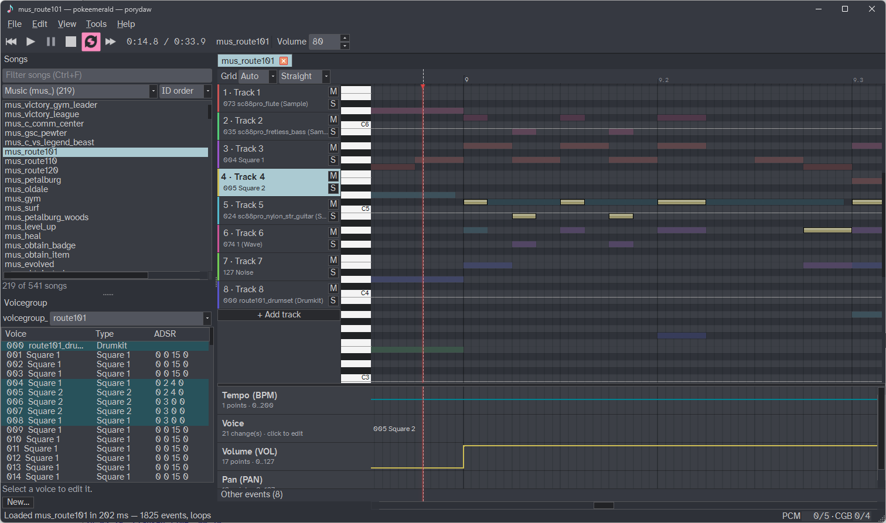

# Porydaw

[](https://github.com/huderlem/porydaw/actions)

A music editor for the Pokémon generation 3 decompilation projects ([pokeruby][pokeruby], [pokeemerald][pokeemerald], and [pokefirered][pokefirered]).

In Porydaw, load your decomp project directory to load the music-related project data. Then, play, edit, and create music. It sounds just like it does in-game.  When saving, Porydaw writes and creates the necessary files directly into the decomp project.  It also supports importing MIDI files, making it easy to whip up songs and voicegroups for brand new songs.

Porydaw is designed for both music beginners and power users who are familiar with DAW programs.  If you've used Sappy or Anvil Studio for your musical needs in the past, then Porydaw is for you!  If you're a power user who loves your existing DAW (FL Studio, Reaper, etc.), give Porydaw a try--but if you can't be pulled away, the [poryaaaa CLAP plugin](https://github.com/huderlem/poryaaaa) helps serve that power-user workflow.

View the work-in-progress documentation: https://huderlem.github.io/porydaw

View the [Changelog][changelog] to see what's new.



## Download

Download Porydaw below to start using it immediately. Older versions of Porydaw may be downloaded from the [Releases][releases] page.

 - [Download Porydaw for Windows](https://github.com/huderlem/porydaw/releases/latest/download/porydaw-windows.zip).
 - [Download Porydaw for macOS (arm)](https://github.com/huderlem/porydaw/releases/latest/download/porydaw-macos-arm64.zip).
 - [Download Porydaw for macOS (intel)](https://github.com/huderlem/porydaw/releases/latest/download/porydaw-macos-x86_64.zip).
 - [Download Porydaw for Linux](https://github.com/huderlem/porydaw/releases/latest/download/porydaw-linux.zip) (AppImage).

Read [INSTALL.md](INSTALL.md) for instructions on how to compile Porydaw from source.

## Architecture

Porydaw is a Swift 6.4 + QML application. Swift owns behavior and exposes it to
QML through QtBridge; there are no QWidgets. Native boundaries include
`src/app/`, `font_metrics.cpp`, and `src/project/`.
The application entry point is the Swift shell
(`src/swift/app/shell/PorydawShellApp.swift`), which loads
`src/ui/shell/PorydawApplication.qml` and `ShellWindow.qml`.

The persistent shell restores geometry, palette, and bundled Atkinson fonts before
showing. After its first frame, it constructs `ShellContent.qml` atomically;
controls and editor attachment then release saved-session restoration and audio preparation.
Hidden windows do not start that work. Explicit project opens still prepare their
dependencies on demand. Closing before the frame or during content creation keeps
the saved-session recipe and waits for scene/audio ownership to settle.

Builds run through Deno tasks against a checkout-local Qt 6.11. On macOS the
Swift toolchain is pinned by `.swift-version` (currently 6.4.0) via swiftly.
The Swift app builds on macOS and Linux. Linux ARM64 has been validated with
Swift 6.4.0 and Qt 6.11.2; Windows Swift build support is pending.

## Contributing

Swift is formatted with swift-format, which ships with the Swift toolchain (`swift format`;
config in `.swift-format`). Only Swift lines you change are formatted, so untouched code keeps
its existing style. TypeScript under `tools/` is formatted with `deno fmt`. Before opening a
pull request, run:

```bash
deno task format                              # format uncommitted Swift changes and tools/*.ts
deno task format --check --base origin/fork-main  # what CI checks for a pull request
```

Build and run the check sweep with Deno:

```bash
deno task checks                             # native check runner harnesses (builds first)
deno task checks --filter swiftcore          # Swift core/presenter suites
deno task checks:shell                       # production ShellWindow QML lanes
deno task checks:qml                         # editor drawer QML lane
deno task checks:qml-roll                    # Swift roll window QML lane
deno task checks:bridge                      # Swift/QML boundary guard
deno task proof check                        # assertion-ledger structure
```

`deno task build:checks --asan` builds the app and native checks with AddressSanitizer
in `build/asan`, separate from normal Debug and Release builds. On macOS it uses
Clang from the selected Swift toolchain so both languages share an ASAN runtime.
Run its native checks with:

```bash
deno run --allow-read --allow-write --allow-run --allow-env=ASAN_OPTIONS,DISPLAY,HOME,PORYDAW_SAMPLE_CORPUS tools/run_checks.ts build/asan/porydaw_checks
```

Checks pin consumer-visible behavior and distinct input/state transitions. Prefer typed
rejections and preserved state over diagnostic wording. Remove assertions implied by
stronger checks in the same state, but retain fixture guards and lifecycle scenarios.
Rendering checks observe painted output rather than pinning renderer-specific primitives.
Update affected proof ledgers with their check changes; compile only referenced support.

### Shell and workspace

The persistent window owns the Swift session and close lifecycle. Shell chrome
(menus, transport, status, window shortcuts and lazy global dialogs) mounts first.
The outer Loader calls `contentReady()` after chrome mounts, then constructs the
workspace synchronously: song list, tabs/editor and polyphony. Late-mounted views
read current session state; closing unloads the application content.
Find Song becomes available once its workspace search field exists. The startup
lane gates first-frame lifecycle, late-mounted song rendering, and a real pointer
edit followed by Undo on the restored song.

### Startup profiling

Measure the Release process's submitted window, chrome, workspace or editable-song frame:

```bash
deno task build:app --release
deno task bench:startup --project /path/to/project --song mus_title --check
deno task bench:startup --until chrome-frame
deno task bench:startup --until workspace-frame
deno task bench:startup --until editor-frame
```

The monotonic interval starts immediately before process creation and ends at the
selected native render-thread `QQuickWindow::frameSwapped` marker. `first-frame`
(the default) measures the initial window; `chrome-frame` and `workspace-frame`
measure a submitted frame synchronized after the respective UI has mounted.
These are queued presentations, not physical display scanout. The first three
endpoints do not establish editable-song or audio readiness. `editor-frame`
requires a visible selected loaded piano roll, a configured positive viewport,
a nonzero display revision and an applied document revision, then a synchronized
submitted frame; it does not establish audible playback.
Asynchronous incubation spreads GUI-thread creation across frames; it does not
run Swift presenters on a background thread.
The first run is reported separately, without claiming a cold OS cache; `--check`
requires every launch, including that first run, to stay below `--budget-ms`
(default 300). Only the benchmark's own processes are terminated. `--help` lists
run-count, budget, and timeout options.

The three bundled Atkinson faces ship as plain files beside the shell QML
(`Contents/Resources` in the macOS bundle, the executable's directory elsewhere).
`FontLoader` registers them by local path, so Qt uses file-backed registration on
every platform instead of copying and parsing compressed qrc data.
After all bundled fonts are registered, an engine-owned worker warms Qt's font
family database and joins before GUI teardown. WAV options, progress and error
windows mount only on first use, then remain available for subsequent requests.
First-post-link launches can still exceed 300 ms: ordinary-launch improvements
are not a cold-start guarantee. The [startup audit](docs/old/first-frame-audio-startup.md)
records retained changes, rejected experiments, and verification.

`bash autoresearch.sh` measures the configured live-project cold launch on a
Debug build, including song restoration and a settled rendered window. It is
not a portable fixture-based check.

Track-name, automation-lane, and time-signature scans borrow a Swift `Span`
from an explicitly scoped array owner to reduce Debug-build iterator
allocations. They still read the current document without caching results
or copying the event buffer.
Catalog parsing likewise iterates borrowed line spans while reading project
files live.

Settings pages are constructed only while the dialog is visible. Opening
the dialog initializes controls from the current settings draft; reopening
after Cancel discards uncommitted field edits.

### UI icons

Every UI icon is a glyph in one generated font, `resources/icons/PorydawIcons.otf`:
Font Awesome outlines copied from their style's face plus custom artwork compiled from
`resources/icons/sources/*.svg`. QML draws them through `AppIcon { icon: Icons.<key> }`.
The Quick Controls style `PorydawStyle` (`src/ui/style/`) is Fusion with its image-backed
indicators (combo and spin arrows, check marks, submenu arrows) drawn as the same glyphs
and its progress bar without an image mask, so startup loads no Qt image plugins.

To add or change an icon, edit `resources/icons/manifest.json` and regenerate the font
and the `Icons` singleton (requires fontTools):

```bash
python3 tools/gen_ui_icons.py --fontawesome /path/to/fontawesome-pro-5.15.4-desktop
```

- The Font Awesome Pro desktop package is a local download; it is never committed.
- Codepoints stay pinned in the manifest's `codepoints`; a new key gets the next one.
- Custom SVGs may use only `path` elements, `matrix()` transforms and `fill-rule`.

## License

Porydaw is licensed under [GPL-3.0](LICENSE). The embedded poryaaaa engine is
licensed under MIT.

## AI Disclaimer

Porydaw's code has been built with heavy usage of Claude Code--bootstrapped with the Fable model.

[pokeruby]: https://github.com/pret/pokeruby
[pokeemerald]: https://github.com/pret/pokeemerald
[pokefirered]: https://github.com/pret/pokefirered
[changelog]: https://github.com/huderlem/porydaw/blob/main/CHANGELOG.md
[releases]: https://github.com/huderlem/porydaw/releases
