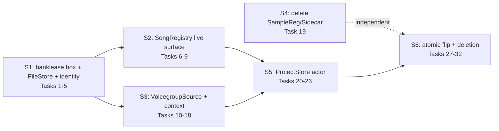

# Plan — Swift port of the project-store backend

Port everything behind the `PdProjectService` C seam to Swift; delete
`src/project/*` C++ and the seam except a minimal bank-lease box. The public
surface of `src/swift/app/ProjectService.swift` is frozen (see spec.md).

Governing documents: `AGENTS.md`, `docs/plans/swift-backend-charter.md`
(normative), `docs/plans/qtbridge-integration-contract.md`. Where this plan
and the charter disagree, the charter wins and this plan is a defect.

## Global Constraints

- **Windows is first-party** (user directive 2026-09-23, supersedes the
  charter's platform deferral for this plan). Only Foundation APIs with real
  Windows implementations: `Data.write(.atomic)`, `moveItem`, `removeItem`,
  `createDirectory`, `contentsOfDirectory`/enumerator, `attributesOfItem`,
  `FileHandle`, `URL(filePath:)`. NEVER `FileManager.replaceItem`
  (NSUnsupported on Windows), CryptoKit (Darwin-only), Dispatch (unavailable
  on Windows Foundation), or NSString path helpers. All surviving C++ is
  MSVC-clean: no Qt, no POSIX, no exceptions across the C boundary.
- **Build-beside-then-flip.** Swift modules land beside the C++ and are
  verified by new Swift checks; production wiring changes once at Task 30.
  No C++→Swift calls ever (no reverse adapters). No parallel implementations
  past the flip gate — the flip commit is the gate.
- **Frozen public API.** `ProjectService.swift`'s public surface
  (`open`/`songLabels`/`openSong`/`save`/`bankApply`/`bankRevert`/`close`;
  `LoadedSong`/`SaveReceipt`/`AppliedBankEdit`/`BankVoice`/`BankSlotView`/
  `NativeBankLease`/`SongConfig`/`SongSource`) does not change. User-visible
  error strings are preserved verbatim (inventory in
  `swift_project_service.cpp:347,547` et al.).
- **Less code, not transliteration.** Dead surface is deleted, not ported.
  Verified dead through the seam: `synthDefinitions` (always `{}` at
  `swift_project_service.cpp:425` → `writeSynthDefinitions`,
  `ensureSynthDataIncluded`, `reopenedVoicegroupContext`, `pruneStaleBanks`,
  `mapsChanged` path all dead); `registrationGaps` (no `PdSongMeta` field →
  `checkRegistrations`/`applyRegistrationGaps` dead); SampleReg/Sidecar/
  ProjectIo/ProjectWorkspace (uncompiled); SongRegistry registration and
  catalog functions; VoicegroupSource catalog/draft/scalar surface.
- **Verification policy.** Implementers reuse the commands recorded in each
  brief's Acceptance predicate without repeating discovery; reassess only if
  scope changes or a command proves stale. Controller runs shared builds and
  the full `deno task verify` at gates. New Swift checks live in
  `src/checks/projectstore/` and register catalog rows per the `swiftGrid`
  pattern (`checkcatalog.cpp:166-179`).
- **Ordering discipline.** Declarations before implementation in every Swift
  file (charter). File-size discipline per AGENTS.md (200–400L target).
- **V-1.** Ported checks assert observable behavior (file bytes, slot views,
  lease validity, conflict errors), never implementation shape. Assertions
  pinning C++ internals are dropped with a recorded reason.

## Seam map

S2 and S3 are mutually independent after S1 — parallel workstreams. S4 is
independent of everything (pure dead-code deletion). S6 is one commit.

## Tasks

| # | Task | Route | Brief |
|---|------|-------|-------|
| 1 | Extract `banklease.{h,cpp}` (lease box + `borrowVoicegroupLease`) | SDD — ownership surgery on a live boundary | briefs-s1.md |
| 2 | Scaffold `PorydawProject` module + modulemap | Direct — mechanical CMake mirror of playback | briefs-s1.md |
| 3 | `ProjectFileStore` helpers | SDD — byte-contract surface everything consumes | briefs-s1.md |
| 4 | `ProjectIdentity` (SongName/VoicegroupId/recipe) | SDD — normalization rules are load-bearing | briefs-s1.md |
| 5 | `ProjectIdentityChecks` Swift suite | SDD — proof-row port ledger | briefs-s1.md |
| 6 | `SongModel` + `SongFlags` value types | SDD — flag merge semantics | briefs-s2.md |
| 7 | `MidiCfg` parse + byte-conservative write + routing | SDD — CRLF byte contracts | briefs-s2.md |
| 8 | Song table/constants/discovery/players/catalog | SDD — parser port | briefs-s2.md |
| 9 | `SongsMk` + `SongsMkChecks` | SDD — byte-conservative recipe edits | briefs-s2.md |
| 10 | `VoicegroupFileIo` threaded readBatch adapter | SDD — C callback + thread fan-out | briefs-s3.md |
| 11 | `VoicegroupProjectContext` Swift type | SDD — native context ownership | briefs-s3.md |
| 12 | Voicegroup value vocabulary | SDD — frozen ordinals | briefs-s3.md |
| 13 | `.inc` line model + parser + open | SDD — byte surgery, riskiest port | briefs-s3.md |
| 14 | Voice edits + blank-slot materialization | SDD — byte surgery | briefs-s3.md |
| 15 | Save + preview shadow-load | SDD — staging + rollback | briefs-s3.md |
| 16 | Minted synths + subvoice facts | SDD — lifetime-ordering rule | briefs-s3.md |
| 17 | `VoicegroupStore` bank logic | SDD — conflict taxonomy + tokens | briefs-s3.md |
| 18 | `VoicegroupStoreChecks` Swift suite | SDD — 98+81 proof-row port | briefs-s3.md |
| 19 | Delete SampleReg + Sidecar | Direct — verified dead, 4 files + CMake | briefs-s4.md |
| 20 | `ProjectStore` actor + dedicated-thread executor | SDD — concurrency contract | briefs-s5.md |
| 21 | Open pipeline | SDD — stage-for-stage port | briefs-s5.md |
| 22 | Read models (songs/playableSong/candidates/cfg) | SDD | briefs-s5.md |
| 23 | `loadBank` (cache + memo + mtime + minted synths) | SDD — lease publication | briefs-s5.md |
| 24 | `applyVoicegroupEdit` + token table | SDD — conflict taxonomy | briefs-s5.md |
| 25 | `saveVoicegroup` (persist + reload + memo refresh) | SDD | briefs-s5.md |
| 26 | `bankleases` seam-level parity suite (pre-flip oracle) | SDD — the flip's regression net | briefs-s5.md |
| 27 | Migrate `native_check.cpp` off DecompProject | SDD — signature change on live helpers | briefs-s6.md |
| 28 | Rewrite exportcheck as Swift suite + bridge | SDD — live consumer migration | briefs-s6.md |
| 29 | vgbankcheck rows → bankleases suite; delete C++ | SDD | briefs-s6.md |
| 30 | Flip `ProjectService` internals onto `ProjectStore` | SDD — the atomic authority switch | briefs-s6.md |
| 31 | Build-graph surgery + `src/project` deletion + corpses | SDD — large deletion set | briefs-s6.md |
| 32 | Catalog re-registration + full-gate verify | SDD — gate | briefs-s6.md |

## Checkpoints

- **After Task 5** (S1 complete): lease box extracted, leaf formats proven —
  commit. Unblocks S2∥S3.
- **After Task 18** (S2+S3 complete): domain modules proven by their own
  suites — commit.
- **After Task 26** (S5+parity suite): store proven beside C++; the
  bankleases suite green against the C++ worker is the pre-flip oracle —
  commit.
- **Tasks 27–32 land as ONE commit** (the flip gate). No intermediate state
  is buildable — the deletion set and the flip are inseparable.
- **Final**: full `deno task verify` green, push `feature/swift-project-store`.

## Named risks (cross-task)

- **Apple-gated Swift lane**: post-flip, bank/export checks don't execute on
  Windows until `src/checks/CMakeLists.txt:103` / root `CMakeLists.txt:168-174`
  un-gates. Documented, not fixed here — the Windows wave owns it.
- **Dedicated-thread executor**: `readBatch` blocks on file I/O; the store
  actor must never run on the cooperative pool (Tasks 10, 20).
- **Minted-synth lifetime**: Swift storage must outlive `voicegroup_free` —
  `deinit` body runs before ivar release; that ordering is load-bearing
  (Task 16).
- **CRLF byte contracts**: read-side `\r` stripping replicates
  `QIODevice::Text` everywhere it was used (`songregistry.cpp:22`,
  `decompproject.cpp:396,440,537`, `songsmk.cpp:84`); writes stay raw-byte.
- **Filter-name preservation**: `vgbankcheck`/`exportcheck-loop`/
  `exportcheck-tail` catalog names survive the flip (CI/scripts depend).
- **No partial revert**: the flip commit reverts whole or not at all —
  partial revert re-creates two authorities.
