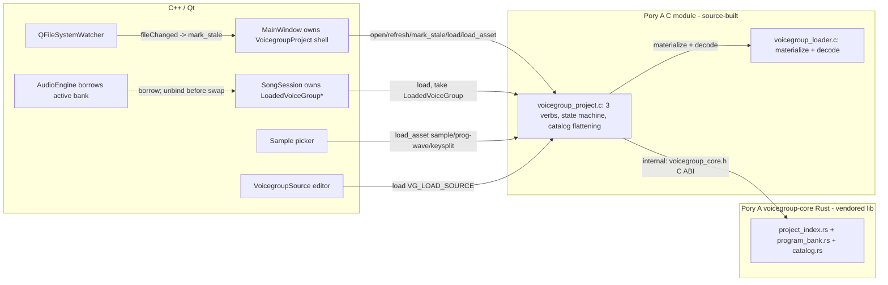

# Voicegroup-Core Migration Plan

Porydaw currently builds Pory A's legacy single-file C voicegroup loader
(`external/poryaaaa/packages/poryaaaa/plugin/voicegroup_loader.c`, 3,199 lines)
and, in the dirty worktree, a legacy discovery cache with its own Porydaw
wiring and a load benchmark. This plan is the authoritative, executable record
for moving Porydaw onto the Rust `voicegroup-core` project index, delivered
through one deep Pory A C module (`VoicegroupProject`) exposing three coarse
operations, without regressing Golden Sun DirectSound synth support or the
layouts Porydaw and the legacy loader accept.

The sample picker's eager full-catalog decode was removed independently before
this migration. This plan does not implement that behavior change again; it
only preserves the existing per-symbol behavior when replacing the legacy
loader call.

## 1. Architecture decision

The migration's dominant question is whether to keep the Rust
`voicegroup-core`, port it to C++, or embed it directly into Porydaw. This
section settles that decision on measured evidence; it is the binding
architecture choice every later section assumes.

### 1.1 Measured baseline

`external/poryaaaa/packages/voicegroup-core/` holds **3,762 production lines of
Rust** (measured `wc -l` over `src/*.rs`) plus a 25-line Pest grammar, and
**2,972 test lines across 73 test functions** (`parser` 16, `analyzer` 16,
`project_index` 18, `plugin_load` 9, `c_api` 4, `catalog` 4, `program_bank` 3,
`c_header` 2, `source_model` 1). `tests/c_header.rs` locks the cbindgen header
to its generating config — a layout-sync guarantee no hand-ported core has.

The core already has two working consumers:

- **Pory A's Rust CLAP plugin depends on the crate directly**
  (`packages/poryaaaa/plugin/Cargo.toml`: `voicegroup-core = { path =
  "../../voicegroup-core" }`), and its `build.rs` compiles the modular C loader
  against the crate's generated header. A C++ core would strand this consumer,
  forcing either reverse FFI bindings or a fork of project semantics.
- **Pory A's modular C loader already materializes banks from the Rust ABI**
  (`packages/poryaaaa/plugin/voicegroup/voicegroup_loader.c:410`,
  `voicegroup_load` → `materialize_core_bank` over `VoicegroupCoreBankResult`,
  with on-demand asset entry points already present at
  `voicegroup_loader.h:111,119`). Rewriting the core rewrites this consumer too,
  roughly 3,778 lines, at the exact seam the migration exists to stabilize.

### 1.2 The three alternatives

| Alternative | Interface depth (all three can expose the same 3-verb module) | Locality (where parsing/state/catalog live) | Build cost | Test cost |
|---|---|---|---|---|
| **Direct Porydaw C++** (re-implement the parser/index inside `VoicegroupProjectContext`) | Same 3 verbs on one opaque handle — achievable, not shallow | Third parser beside the kept `VoicegroupSource` editor | In-tree C++ | Re-derive 3,762+2,972 lines + 73 tests; no `c_header` equivalent |
| **Upstream C++ library** (port `voicegroup-core` to a C++20 static lib in Pory A) | Same 3 verbs on one opaque handle — achievable | Same as Rust (good) | **Wins**: no cbindgen, no vendored `.a` | ~3,600 LOC port + ~3,000 LOC test port (~2.5–3× effort) |
| **Keep-Rust deep adapter** (this plan) | Same 3 verbs on one opaque handle | **Best**: one C module owns flattening + state machine | Vendored static libs (irreducible, §14) | 73 tests + `c_header` lock survive untouched |

**Neither C++ alternative is rejected for shallowness.** Both can expose the
same deep three-operation module (§5–§6); the plan does not assume per-field
accessors for either. They are rejected on cost and governance grounds.

**Direct Porydaw C++** would make Porydaw the sole owner of parsing/indexing
semantics that Pory A already owns, shares, and tests (minutes 22, 65), and
would add a third parser beside the kept `VoicegroupSource` editor model
(minutes 57–58) — duplicated semantics and the "second source of truth" the
minutes forbid.

**Upstream C++ library** is rejected on cost and co-consumer grounds. Its only
durable win is eliminating the vendored static libraries, which are already a
provisional, bounded scaffolding step (minutes 52–56). In exchange it re-derives
3,762 production lines, 2,972 test lines, and 73 tests; replaces the 25-line
Pest grammar with a hand-rolled parser whose legacy quirks (slot-advance on bad
arguments, prefix order, `@`/`//` comment stripping) must be reproduced exactly
(parser + test port cost); and strands Pory A's direct Rust plugin consumer,
forcing reverse FFI bindings or a fork of project semantics. It is a
distribution simplification, not a migration simplification.

**Keep-Rust deep adapter is selected.** The Rust core is already deep and
correct (`ProjectIndex::load`, `load_program_bank`, `analysis_context`), and the
modular C loader already materializes against it. The migration's real cost is
not Rust and not the vendored libraries — it is the naive shallow accessor seam
the plan avoids by design, a caution that applies equally to any of the three
implementations. Keeping Rust and moving the Porydaw-facing seam down to three
whole-struct verbs (§5–§6) yields the same deep module without the port,
test-port, reverse-FFI, or duplicated-semantics cost of either C++ alternative,
and confines the only irreducible keep-Rust residue to the precompiled artifact
distribution (§14).

### 1.3 Revisiting condition

The C++ rewrite is preserved only as a **revisitable option if Rust ceases to
be a co-consumer** — that is, if Pory A's Rust plugin (and any other Rust
consumer of the crate) is removed or migrated off the crate such that no
Rust-side consumer remains. Until then, a C++ core is a fork or a reverse-FFI
obligation, and both are rejected by settled governance (minutes 22, 65).

## 2. Authority and scope

`docs/voicegroup-core-migration-minutes.md` is the historical decision record.
This plan is the normative, implementation-ready contract. Where the minutes
and this plan differ, this plan wins because it resolves every open question
named in the minutes.

All seam, compatibility, distribution, and catalog decisions below are derived
from the minutes and the repository sources cited inline.

Conservative conflict resolutions (these override any single source when they
disagree):

1. **Runtime bank replacement is all-or-nothing.** Invalid proposed/disk source
   may be *displayed*, but is never *partially installed*. Any missing or
   corrupt decoded asset blocks the whole replacement.
2. **Preserve currently accepted legacy layouts/overflow** unless an explicit
   compatibility gate proves and approves removal.
3. **Pory A's C module remains source-built through the existing
   `external/poryaaaa` submodule.** Only the Rust static libraries and the
   generated header are vendored.
4. **Delete only Porydaw's legacy wiring/cache.** The upstream legacy loader
   sources (`plugin/voicegroup_loader.{c,h}`) remain in the frozen submodule;
   completion is Porydaw no longer building or referencing them.
5. **Generate both** a compile-time ABI constant in the generated header **and**
   a runtime version function.

### Non-goals

- Moving Porydaw's C++ `VoicegroupSource` editing/source-preservation/save logic
  into Rust (deferred, minutes 57–58).
- GitHub Release publishing and automatic artifact downloads (deferred, minutes 56).
- The Sample Studio loading path (minutes 36).
- An async loader, a metadata-only read path, or row-level metadata machinery.
- Porydaw-side Rust or Cargo for ordinary contributors (minutes 52).

## 3. Glossary

- **Seam A (internal)** — the C ABI in
  `packages/voicegroup-core/include/voicegroup_core.h`, generated by cbindgen
  from `c_api.rs`, backed by Rust `project_index.rs`. Consumed **only** by Pory
  A's `voicegroup_project` C module. Porydaw never sees it, never consumes Rust
  types, and never calls a `voicegroup_core_*` accessor.
- **Seam B (public)** — the hand-written C header
  `packages/poryaaaa/plugin/voicegroup/voicegroup_project.h`, defining one
  opaque `VoicegroupProject` handle with three operation families (§6). This is
  the only seam Porydaw consumes.
- **VoicegroupProject** — the opaque Pory A C module owning, per open project:
  the Rust project index, the flattened catalog snapshot, the watch set, the
  structured diagnostics, the Fresh/Stale/RefreshFailed state machine, and the
  on-demand picker asset cache.
- **Generation** — one successful transactional rebuild of the module's catalog
  and index snapshot. Each generation owns the picker cache built against it.
- **Materialize** — build a complete `LoadedVoiceGroup` (Rust-resolved bank +
  C decode/subgroup/keysplit/synth) ready for runtime.
- **Decode** — sample bytes → `WaveData` (wav/aif/bin); owned by the C module,
  never by Rust core.
- **Fresh / Stale / RefreshFailed** — module states; see §11. They live inside
  the C module, not in a C++ wrapper.
- **Proposed / preview source** — unsaved, in-memory voicegroup source text;
  identified by `(authoritative project-relative path, full-file bytes, bank
  name, transient synth overlay)`, no temp-file identity.
- **Saved source** — the real voicegroup file on disk.
- **Document undo** — kept; the existing C++ editor's undo/redo of source edits.
- **Bank-replacement history / backup cache** — forbidden; replacement is a
  single transactional swap with no history.
- **Runtime bank** — the `LoadedVoiceGroup` installed on a `SongSession` and
  borrowed by the audio engine. Distinct from the display-side catalog/diagnostics.

## 4. Definition of done

The migration is complete when all of the following hold:

1. `voicegroup-core` is the single source of truth for project discovery,
   voicegroup parsing, structural checks, and symbol-to-project-path indexing;
   Porydaw never builds its own index or consumes Rust collections.
2. Pory A's C module performs all sample decode, runtime allocation, and
   `LoadedVoiceGroup` lifetime, and is source-built from the frozen submodule
   commit — not vendored.
3. Only the Rust static libraries + matching generated header + manifest are
   vendored; ordinary Porydaw builds require neither Rust nor Cargo.
4. One `VoicegroupProject` per open project is owned by `MainWindow`; each
   `SongSession` still owns its `LoadedVoiceGroup`; the audio engine only
   borrows and unbinds before replacement/destruction.
5. Replacement is transactional and all-or-nothing: a complete replacement is
   built first; on any failure the last-good bank is kept and structured
   diagnostics are surfaced; an initial catastrophic refresh failure installs
   no playback bank and shows one project-level error unless a real partial
   catalog exists.
6. Unsaved voicegroup edits stay in memory, are validated through
   `voicegroup-core` against the retained index, and materialize identically to
   a saved bank; no temp preview file and no search-path override exist.
7. The project-wide sample picker remains on demand after cutover: the existing
   per-symbol legacy-loader call moves to `load_asset` without restoring an
   eager full-catalog decode. The search box can commit only index-resolved
   symbols, and a keysplit row receives a typed auditionable result.
8. All six Golden Sun synth aliases index and materialize byte-identically to
   the legacy loader; creation, loading, audition, and playback are unchanged.
9. Structured diagnostics cross the public seam losslessly: stable code,
   message, optional content/asset paths, full optional start/end ranges, and
   optional slot; public result structs retain private ownership storage until
   their matching `_free`, and Qt copies diagnostics into each session.
10. The mandatory Seam-A bulk snapshot carries catalog, diagnostics, actual
    content paths, dependency paths, and watch paths. The preserved legacy test
    ideas (project switching, stale source changes, nested discovery,
    invalidation) pass against the new seam; every legacy Porydaw caller is
    migrated, the cache experiment and its wiring are removed, and Porydaw no
    longer builds or references the legacy loader only after §18 passes.
11. Every acceptance criterion in §15 and §17–§18 is demonstrably true.

## 5. The deep module



| Seam | Interface | Backed by | Owner | Seen by Porydaw as |
|---|---|---|---|---|
| A (internal) | `packages/voicegroup-core/include/voicegroup_core.h` (cbindgen) | `src/project_index.rs`, `src/c_api.rs`, `src/program_bank.rs`, `src/catalog.rs` | Pory A Rust | not at all — consumed only by the C module |
| B (public) | `packages/poryaaaa/plugin/voicegroup/voicegroup_project.h` (hand-written) | `voicegroup_project.c` + `vg_*.c` | Pory A C | source-built from the frozen submodule commit |

Header-name collision: the legacy `plugin/voicegroup_loader.h` (3-arg
`voicegroup_load(projectRoot, name, config)` + `voicegroup_load_samples`) and the
modular `plugin/voicegroup/voicegroup_loader.h` (2-arg `voicegroup_load`) share a
basename. Porydaw includes the bare legacy name today
(`src/project/voicegroupsource.h:12`, `src/audio/audioengine.h:20`,
`src/audio/wavexport.h:11`). After cutover, includes become
`voicegroup/voicegroup_project.h`. The legacy files stay in the frozen submodule
and are no longer built or referenced by Porydaw.

## 6. Interface

The public header is hand-written plain C. Rust never defines these structs, so
there is no cross-language layout hazard and no cbindgen constraint on the
Porydaw-facing contract. The result structs are owning values: their public
fields are read-only views into a private result arena carried by the
`_private_storage` member. Callers must not shallow-copy or retain a view after
the matching `_free`.

```c
/* voicegroup_project.h — Pory A. One opaque project module; 3 verb families.
   Result structs are plain C, defined here by hand; Rust never sees them.
   `_private_storage` is implementation-owned and callers must not inspect it. */

typedef struct VoicegroupProject VoicegroupProject;      /* opaque handle */
typedef struct VoicegroupSynthOverlay VoicegroupSynthOverlay; /* opaque build-set */

typedef struct {                       /* structured diagnostic, one block */
    const char *code;                  /* owned by the result's private storage */
    const char *message;
    uint32_t scope;                    /* 0 structural, 1 slot, 2 materialization */
    const char *source_path;           /* NULL when none (actual content path) */
    const char *asset_path;            /* NULL when none (failed dependency) */
    bool has_range;
    size_t start_line, start_column;   /* 1-based, inclusive; 0 = no range */
    size_t end_line, end_column;       /* 1-based, end-exclusive; 0 = no range */
    bool has_slot; size_t slot;
} VoicegroupDiagnostic;

typedef struct {                       /* one picker/browser catalog row */
    uint32_t kind;                     /* 0 vg, 1 direct-sound, 2 prog-wave,
                                          3 keysplit, 4 drumkit, 5 synth */
    const char *symbol, *display_name; /* canonical + Rust display name */
    const char *source_path;           /* actual indexed content path; NULL when none */
    const char *asset_path;            /* direct dependency path; NULL when none */
    const char *const *dependency_paths; /* all Rust-indexed dependencies for this row */
    size_t dependency_path_count;
    const char *subgroup, *table;      /* Rust-owned keysplit pair; NULL otherwise */
    const char *drumkit;               /* Rust-owned drumkit; NULL when none */
    bool has_adsr; uint8_t adsr[4];    /* Rust-owned typical ADSR */
    bool has_synth; uint8_t synth_desc[6];
} VoicegroupCatalogEntry;

typedef struct {                       /* full bulk project snapshot */
    bool succeeded;
    const VoicegroupDiagnostic *diagnostics; size_t diagnostic_count;
    const VoicegroupCatalogEntry *catalog;    size_t catalog_count;
    const char *const *content_paths;         /* actual indexed source files */
    size_t content_path_count;
    const char *const *dependency_paths;      /* referenced wav/aif/bin/etc. */
    size_t dependency_path_count;
    const char *const *watch_paths;           /* deduplicated files to watch */
    size_t watch_path_count;
    void *_private_storage;                   /* result-owned; never inspect */
} VoicegroupProjectResult;

typedef enum { VG_LOAD_SAVED, VG_LOAD_SOURCE } VoicegroupLoadMode;
typedef struct {
    VoicegroupLoadMode mode;
    const char *bank_name; size_t bank_name_len;           /* SAVED + SOURCE (required) */
    const char *relative_path; size_t relative_path_len;   /* SOURCE, authoritative */
    const char *source_bytes; size_t source_len;           /* SOURCE, full file */
    const VoicegroupSynthOverlay *overlay;                 /* NULL = none */
} VoicegroupLoadRequest;

typedef struct {                       /* bank materialization result */
    bool succeeded;
    const VoicegroupDiagnostic *diagnostics; size_t diagnostic_count;
    void *_private_storage;             /* owns diagnostics and an untaken bank */
} VoicegroupLoadResult;

typedef struct {                       /* typed keysplit result for audition */
    const ToneData *subgroup;           /* result-owned VOICEGROUP_SIZE entries */
    size_t subgroup_count;
    const uint8_t *table;               /* result-owned MIDI-note map */
    size_t table_count;                 /* always 128 on success */
} VoicegroupKeysplitAsset;

typedef struct {                       /* one fully decoded picker asset */
    uint32_t kind; const char *symbol;
    const void *payload; size_t payload_len;  /* DS/prog-wave bytes; result-owned copy */
    const uint8_t *synth_desc;                /* 6 bytes when synth, else NULL */
    VoicegroupKeysplitAsset keysplit;         /* populated only for VG_ASSET_KEYSPLIT */
    bool has_loop; size_t loop_start, loop_length; /* loop points; false/0 when none */
    uint32_t sample_rate; size_t frame_count;      /* decoded WaveData metadata */
    const VoicegroupDiagnostic *diagnostics; size_t diagnostic_count;
    void *_private_storage;             /* owns every view above */
} VoicegroupAssetResult;

/* ---- family 1: own / refresh / stale the project (lifecycle + state) ---- */
VoicegroupProject *voicegroup_project_open(const char *root, size_t root_len);
void voicegroup_project_refresh(VoicegroupProject *p, VoicegroupProjectResult *out);
void voicegroup_project_mark_stale(VoicegroupProject *p);
void voicegroup_project_result_free(VoicegroupProjectResult *r);
void voicegroup_project_free(VoicegroupProject *p);

/* ---- family 2: materialize one bank — saved or unsaved preview ---- */
VoicegroupLoadResult voicegroup_project_load(VoicegroupProject *p,
                                             const VoicegroupLoadRequest *req);
LoadedVoiceGroup *voicegroup_load_result_take(VoicegroupLoadResult *r); /* transfers bank + disarms the drop; NULL on failure */
void voicegroup_load_result_free(VoicegroupLoadResult *r);              /* frees storage + drops an untaken bank (voicegroup_free) */

/* ---- family 3: on-demand picker asset (sample / prog-wave / keysplit) ---- */
typedef enum { VG_ASSET_DIRECT_SOUND = 0, VG_ASSET_PROG_WAVE = 1,
               VG_ASSET_KEYSPLIT = 2 } VoicegroupAssetKind;
VoicegroupAssetResult voicegroup_project_load_asset(VoicegroupProject *p,
    VoicegroupAssetKind kind, const char *symbol, size_t symbol_len);
void voicegroup_asset_result_free(VoicegroupAssetResult *r);

/* ---- transient synth overlay (the only auxiliary type) ---- */
VoicegroupSynthOverlay *voicegroup_synth_overlay_create(void);
void voicegroup_synth_overlay_add(VoicegroupSynthOverlay *o,
    const char *name, size_t name_len, uint8_t desc[6]);
void voicegroup_synth_overlay_free(VoicegroupSynthOverlay *o);
```

**What counts as three operations.** The verb families are **(1) lifecycle**
(open/refresh/mark_stale/free — one verb, with C's no-constructor syntax split
across functions), **(2) load** (saved or source), and **(3) load_asset**.
`VoicegroupSynthOverlay` is a tiny build-set kept because the minutes mandate
*typed* transient synth defs (minutes 60, §7); it is optional for non-synth
callers.

**Result ownership.** Every result struct owns its private arena through
`_private_storage`; its diagnostics, catalog rows, content/dependency/watch
paths, strings, decoded payloads, synth descriptor, and typed keysplit
`subgroup`/`table` views remain valid until the matching `_free`. The caller
copies any data it retains, including diagnostics copied into a Qt session.
`VoicegroupLoadResult` additionally owns its `LoadedVoiceGroup` until
`voicegroup_load_result_take` transfers it out and disarms the drop, or
`voicegroup_load_result_free` destroys the untaken bank via `voicegroup_free`.
`VoicegroupAssetResult` owns a copy of decoded sample/prog-wave/keysplit data;
the module's generation cache keeps separate bytes (§10, §12), and an asset
result never takes a `LoadedVoiceGroup*`.
The mandatory internal Seam-A snapshot supplies the catalog, diagnostics,
content paths, dependency paths, and watch set to the C module in one bulk
result; no per-field accessor is part of the migration contract.

All strings crossing the seam — source text, symbols, source/asset paths,
display names, diagnostic `code`/`message` — are dynamically allocated UTF-8
owned by result storage (no fixed-size buffers, no truncation, no multi-byte
split), so the ownership rule covers them uniformly.


**Caller example.** Porydaw wraps the handle in a small RAII shell
(`src/project/voicegroupproject.{h,cpp}`, ~60 lines), replacing the old
`VoicegroupContext` wrapper. `LoadedVoiceGroup*` ownership is unchanged
(`src/songsession.h:39-41`).

```cpp
// MainWindow open / reload — family 1
m_vgProject = voicegroup_project_open(rootUtf8.constData(), rootUtf8.size());
VoicegroupProjectResult snap{};
voicegroup_project_refresh(m_vgProject.get(), &snap); // explicit refresh is a retry
copyDiagnosticsForSession(snap.diagnostics, snap.diagnostic_count);
for (size_t i = 0; i < snap.catalog_count; ++i)          // plain struct iteration
    m_vgBrowser->addRow(snap.catalog[i].kind, snap.catalog[i].display_name,
                        snap.catalog[i].symbol, snap.catalog[i].asset_path);
for (size_t i = 0; i < snap.watch_path_count; ++i) {
    const auto path = QString::fromUtf8(snap.watch_paths[i]);
    m_watcher.addPath(path);
    m_watcher.addPath(QFileInfo(path).absolutePath()); // recreation watch
}
voicegroup_project_result_free(&snap);

// QFileSystemWatcher fires OR Porydaw writes — both are mark_stale
void MainWindow::onWatchedPathChanged(const QString &) { m_vgProject.markStale(); }
void MainWindow::markVgCatalogStale()                 { m_vgProject.markStale(); }

// SongSession load saved bank — family 2 (was voicegroup_load(root, name, cfg))
VoicegroupLoadRequest req{VG_LOAD_SAVED, nameUtf8.constData(), nameUtf8.size(),
                          {}, 0, {}, 0, nullptr};
VoicegroupLoadResult r = voicegroup_project_load(m_vgProject.get(), &req);
LoadedVoiceGroup *bank = voicegroup_load_result_take(&r);   // NULL on failure
copyDiagnosticsForSession(r.diagnostics, r.diagnostic_count);
if (bank) swapVoicegroup(session, bank, slot);              // transactional bind + free old
else      keepLastGoodBank(session);
voicegroup_load_result_free(&r);

// Preview unsaved editor text with pending synths — family 2 again
VoicegroupLoadRequest prev{VG_LOAD_SOURCE, bankNameUtf8.constData(), bankNameUtf8.size(),
                           relPathUtf8.constData(), relPathUtf8.size(),
                           sourceUtf8.constData(), sourceUtf8.size(),
                           pendingSynthOverlay()};
VoicegroupLoadResult pr = voicegroup_project_load(m_vgProject.get(), &prev);

// Picker row becomes current — family 3
VoicegroupAssetResult a = voicegroup_project_load_asset(m_vgProject.get(),
                                                        VG_ASSET_DIRECT_SOUND,
                                                        symbolUtf8.constData(), symbolUtf8.size());
if (a.kind == VG_ASSET_KEYSPLIT)
    auditionKeysplit(a.keysplit.subgroup, a.keysplit.subgroup_count,
                     a.keysplit.table, a.keysplit.table_count);
else
    audition(a.payload, a.payload_len, a.synth_desc);
updateDetailLine(a.sample_rate, a.frame_count, a.has_loop, a.loop_start, a.loop_length);
voicegroup_asset_result_free(&a);
```

**Hidden implementation.** All index and asset plumbing lives behind the three
verbs in the C module: `open` only allocates the handle and copies the root path
(no index build, no validation — it can fail only on OOM, returning NULL). The
first `refresh` performs the structured index build and validation, then copies
Rust's **mandatory bulk project snapshot** — catalog rows, full diagnostics,
actual content paths, dependency paths, and the deduplicated watch set — into a
contiguous generation. Rust's catalog owns the keysplit subgroup/table pair,
drumkit, ADSR, display name, actual content path, direct asset path, and each
row's dependency paths; the C module does not reconstruct any of those fields.
Catalog deduplication is deterministic (first in index-file order wins).
Rebuilds happen in scratch storage before swap-and-free. An invalid project is
returned through `VoicegroupProjectResult.succeeded=false` plus structured
diagnostics, never a global error string. Seam A exposes one bulk snapshot
operation, not optional per-field accessors; `load_program_bank_source` is the
only additional source-load operation.

`load` dispatches `VG_LOAD_SAVED` →
`voicegroup_core_project_index_load_program_bank` and `VG_LOAD_SOURCE` →
`load_program_bank_source`, then runs the existing `materialize_core_bank`
pipeline (`voicegroup_loader.c:356-402`). `load_asset` resolves `(kind, symbol)`
against the current generation, decodes through the existing `vg_wav`/synth/
keysplit code, and returns a caller-owned copy. A keysplit result is the typed,
auditionable `VoicegroupKeysplitAsset`, not an untyped map blob and never a
registered bank. `refresh` is an explicit force-retry (§11); ordinary
`load_asset`/saved `load` rebuild only when stale. `VG_LOAD_SOURCE` may continue
while disk refresh is failed: it validates the supplied full source against the
module's retained last-good index plus its transient overlay, allowing the
source that caused the disk failure to be repaired without inventing a disk
generation. The Fresh/Stale/RefreshFailed state machine (§11) lives here too.

Seam A is **internal to Pory A**: the one mandatory bulk snapshot adapter is its
only consumer, and Porydaw never sees Rust collections or `voicegroup_core_*`.

## 7. Full-file preview and typed synth overlay

**Preview identity.** Preview is `(authoritative project-relative path,
full-file bytes, bank name, transient synth overlay)` — never a bare string
pair. Rust gains `ProjectIndex::load_program_bank_source(bank_name,
project_relative_path, source_bytes, overlay)` that: parses the bytes as one
standalone document; locates the named bank; `analyze_document` against
`analysis_context()` so sample/keysplit/sub-voicegroup symbols still resolve
from the retained on-disk index (`project_index.rs:124-142`); reports
`source_relative_path` as the authoritative path so display-name/diagnostic
paths point at the real file; and maps **full start/end line and column ranges**
1:1 onto the source bytes (no `remap_range` offset). All inputs are borrowed
for the call only. The overlay supplies transient DirectSound synth definitions
(for example pending `applyPendingSynthTones` edits) not yet on disk.
`VG_LOAD_SOURCE` materializes the result identically to `VG_LOAD_SAVED`.

When the disk generation is `RefreshFailed`, `VG_LOAD_SOURCE` is still
permitted: it uses the module's retained last-good index as its analysis
context plus the supplied full source bytes and transient overlay. A valid
source preview can therefore repair the source that broke disk refresh; it
does not silently replace the failed disk generation or fabricate catalog rows.
If there is no retained index, the source load returns the project-level
diagnostic. No temp file and no
`VoicegroupLoaderConfig.voicegroupPaths` override exist (replaces
`src/mainwindow.cpp:2558-2586`).

**Typed synth overlay.** Synth symbols are DirectSound symbols whose resolved
asset is a 6-byte descriptor, not a file. They appear inline in
`sound/direct_sound_data.inc` and in `sound/direct_sound_synth_data.inc`
(legacy discovery `voicegroup_loader.c:786-796`). The legacy parser emits
`{0x80, type, p1..p4}` (`parse_synth_macro_line`, `voicegroup_loader.c:858-902`):

| Canonical name | Alias | type byte | params |
|---|---|---|---|
| `set_synth_custom` | `set_synth_pulse` | 0 | 4 (base duty, duty-LFO step, modulation, phase) |
| `set_synth_25` | `set_synth_saw` | 1 | 0 |
| `set_synth_50` | `set_synth_triangle` | 2 | 0 |

`index_symbol_file` (`project_index.rs:464-493`) gains a third branch: after a
label, recognize `set_synth_*` via `synth_descriptor(line) -> Option<[u8;6]>`
(guarding against `set_synth_50` matching a `set_synth_5` prefix, as legacy
`voicegroup_loader.c:885-886`). `ResolvedAsset` (`program_bank.rs:124-129`) gains
`synth_desc: Option<[u8;6]>`; `DirectSoundProgram` gains
`sample_synth_desc: Option<[u8;6]>`; `index_standard_symbol_files`
(`project_index.rs:456-462`) adds `sound/direct_sound_synth_data.inc`. The C
module's `materialize_directsound` synthesizes the `WaveData` byte-identically
to legacy `resolve_and_load_sample` (`voicegroup_loader.c:1754-1778`):
`type=0, status=0x4000, freq=0x01058920, loopStart=0, size=0`, six descriptor
bytes into `data`. On-disk synth symbols then resolve through Rust, so the
on-disk half of Porydaw's post-load `applyPendingSynthTones` patch
(`src/mainwindow.cpp:2597-2651`) is unnecessary for the seam (its removal is a
later widget step).

**Pending synth minting and graduation.** Porydaw's `m_pendingSynths`
(`src/mainwindow.cpp:2383-2386`) holds synth definitions not yet on disk. After
cutover the only override that resolved those on load (the `voicegroupPaths`
config path) is gone, so pending defs ride the transient overlay instead: every
preview/undo/redo that loads source whose symbols include pending defs populates
a `VoicegroupSynthOverlay` with one entry per pending `(symbol, desc)` in
`m_pendingSynths` and passes it to `voicegroup_project_load`. Pending symbols
therefore stay loadable before save, and `synthDescForSymbol`
(`src/mainwindow.cpp:2589-2595`) resolves them from `m_pendingSynths` unchanged.
An unsaved synth-param edit that mints a new symbol (any of the six Golden Sun
spellings in the table above) stays preview-only until graduation.

**Save-time graduation** (inside `saveSession`, `src/mainwindow.cpp:1489-1572`),
in strict order: (1) write the pending `(symbol, desc)` definitions to
`sound/direct_sound_synth_data.inc` via `writeSynthDefinitions`; (2)
`markStale()`; (3) refresh so the index registers the new symbols; (4) only
after the refresh and the reload that verifies the saved voicegroup parses both
succeed, remove the graduated symbols from `m_pendingSynths`. If any step
fails, `m_pendingSynths` is left intact, the error is surfaced, and no partial
graduation occurs.

## 8. Edit/materialization acceptance

One call = validate + materialize. No separate validate-only pass (minutes 57).
- **GUI-rejected edit.** An unsaved in-memory edit that fails validation shows
  diagnostics inline but commits nothing; the row keeps its last valid bank and
  **stays enabled** (the last-good row remains usable).
- **Invalid disk/undo state.** A saved voicegroup that no longer validates, or
  an undo/redo step that reaches invalid source, keeps the last-good audio
  bound (never a silent rollback) but renders the invalid displayed row/editor
  with the invalid markers and **disabled**; only that invalid displayed row is
  disabled, while the last-good audio stays bound, sourced from the catalog +
  diagnostics (§9).
- **Undo/redo.** Each undo/redo step re-runs validate + materialize against the
  restored source text; success swaps the bank, failure keeps the last-good
  audio bound and surfaces the diagnostic (never a silent rollback).
- **Accept + swap** iff a complete bank materializes with zero blocking
  diagnostics and all referenced assets decode. On any failure, keep the
  last-good bank and surface diagnostics (all-or-nothing, §2). When a watched
  dependency changed and the dependent voicegroup fails to revalidate, the
  last-good audio stays bound until a valid replacement materializes.
**Diagnostic shape (stable across the public seam):** `code` (string),
`message`, `scope` (`structural` | `slot` | `materialization`), optional
`source_path` (the actual voicegroup/proposed content file), optional
`asset_path` (the referenced sample/wave dependency; set on materialization
failures), optional **full** 1-based `start_line`/`start_column` through
`end_line`/`end_column` range, and optional `slot`. `source_path` and
`asset_path` are separate optional fields: a structural error points at
`source_path` with its source range, and a materialization failure points at
`asset_path` with `has_range=false` and all range fields zero. **No warning
severity** exists in the migration interface (minutes 47); a voice is valid
and loads, or it is an error.

**Three result classes**, distinguishable by bank presence + diagnostic shape:

- **A. Structural invalid source** — no bank + diagnostics with
  `scope=structural`, optional `source_path`, and a full range/slot. Whole
  document unparseable, read failed, or named bank absent
  (`project_index.rs:270-335`). `voicegroup_load_result_take` returns NULL.
- **B. Slot-level diagnostic** — a candidate bank is materialized but specific
  slots carry blocking diagnostics with source ranges. Porydaw does not
  install a partial bank: the all-or-nothing rule blocks the swap, while an
  existing catalog row renders the voice with an error marker and disabled
  editor.
- **C. Materialization failure** — Rust resolved the bank, but C decode/
  subgroup/keysplit/synth fails with no Rust range (missing/corrupt asset,
  minutes 48). Diagnostic has `scope=materialization`, `asset_path` = failed
  dependency, `message`, `slot`, and no range. Any such failure blocks the
  replacement.

**Display vs runtime separation.** The voicegroup list, per-voice markers, and
detail panel render from the actual catalog + diagnostics in the current
snapshot, independent of the installed bank. Qt deep-copies every diagnostic
needed by each `SongSession` before freeing its result, including code, message,
paths, full range, and slot. The installed `LoadedVoiceGroup` changes only
through a complete transactional swap. Invalid source is displayed but never
partially installed.

**RefreshFailed UI.** When a refresh fails, a retained last-good generation
keeps its catalog, content paths, dependency paths, watch paths, and bank
active; a non-modal error marker in the browser shows the failed refresh with
the first diagnostic's path/range/message; transport/editor controls for an
affected existing voice are disabled. The failed `VoicegroupProjectResult`
returns `succeeded=false`, the failure diagnostics, and the retained snapshot
when one exists. If no generation or partial index exists, all snapshot arrays
are empty. `load` and `load_asset` return the cached failure without rebuilding.
Every explicit `voicegroup_project_refresh` is a force-retry, including from
`RefreshFailed`; a successful refresh replaces the generation. `VG_LOAD_SOURCE`
is the exception for recovery: it may use the retained last-good index plus its
source bytes and overlay to materialize a repair preview while disk remains
failed (§7), without changing the failed snapshot.

**Initial catastrophic failure.** `voicegroup_project_open` only allocates the
handle; the first `refresh` performs the structured index build. An invalid
root or unparseable index returns `succeeded=false` + diagnostics (never a
global error string; only OOM makes `open` return NULL). If no valid or partial
index exists, there is no playback bank and the browser shows one project-level
error — it does **not** invent voice rows. If Rust produced a real partial
catalog, the browser may show only those indexed rows with their diagnostics;
rows are never synthesized from a failed path or bank name.

## 10. Ownership, destruction, and audio invariants

Ratified ownership model (Wave 4 is a gate, not a future design decision):

- `MainWindow` owns exactly one `VoicegroupProject` per open project — no
  process-wide global cache. Declaration order in `src/mainwindow.h`:
  `m_audio` (line ~289) → `m_project` (~294) → `m_vgProject` (new) →
  `m_sessions` (~296), so reverse-declaration destruction frees sessions (and
  their `LoadedVoiceGroup`s) before the project; `m_audio` dies last.
- The C module owns the Rust index, the mandatory bulk catalog snapshot,
  content/dependency/watch paths, diagnostics, state machine, and internal
  decoded-asset cache. The cache is keyed by `(asset kind, canonical symbol)`
  and freed per generation on `mark_stale()` or `close()`. Each
  `voicegroup_project_load_asset` call returns a fresh owning
  `VoicegroupAssetResult` whose private storage owns a copy of the cached
  bytes, typed keysplit subgroup/table, and diagnostics. The cache's bytes stay
  module-owned, so no double-free or dangling is possible. The module does not
  own any `LoadedVoiceGroup` after `voicegroup_load_result_take`.
- Each `SongSession` keeps owning its `LoadedVoiceGroup*` and `VoicegroupSource`
  (already true: `src/songsession.h:39-41`, freed in dtor `:63-73`). It also
  owns a deep copy of the diagnostics used to render that session. A
  `LoadedVoiceGroup` may outlive the module and every result arena.
- The audio engine only borrows the active session's voicegroup. **Unbind before
  replacement or destruction** via `swapVoicegroup` (`src/mainwindow.cpp:2653-2672`)
  and `unloadSong` (`src/audio/audioengine.cpp:389-419`). `teardownSessions`
  (`src/mainwindow.cpp:910-919`) unbinds the engine first.
- No reference counting; no shared `LoadedVoiceGroup` across tabs (no
  demonstrated need).

**Build continuity.** `LoadedVoiceGroup`, `ToneData`, `WaveData`, and all
runtime constants come from one canonical modular runtime-types header. The
Wave 3 module exports only `voicegroup_project_*` entry points, so it can coexist
temporarily with the legacy loader without duplicate symbols. Waves 0–7 keep
the legacy Porydaw target intact; Waves 8–10 link the new project module only
for migrated catalog, picker, and validation paths while saved-bank/preview
callers remain legacy. Wave 11 atomically migrates every remaining legacy
caller and switches the engine target. No intermediate commit may contain
duplicate runtime types, duplicate loader symbols, or an unlisted caller.

**Swap protocol (all-or-nothing, §2).** A swap occurs only at a safe UI reload
action (§11). The replacement `LoadedVoiceGroup` is fully materialized *before*
the engine is told to swap; the swap is then a bind of the new bank + free of
the old. If materialization fails, the old bank stays bound and the engine is
never touched. The engine's audio callback never accesses the module.

**Preload guarantee.** Samples referenced by the active `LoadedVoiceGroup` remain
preloaded before playback can use them; picker on-demand loads never serve
playback. Audio handoff is cold (device stopped) at `loadSong`
(`src/audio/audioengine.cpp:203-247`) and `updateVoicegroup` (`:320-339`).

**Threading.** All module operations — refresh, catalog read, preview
validation, asset load — are synchronous on the UI thread. The watcher callback
runs on the UI thread, copies any diagnostics needed by the session, and only
calls `mark_stale()`; it never frees the active voicegroup or touches the audio
engine.

## 11. State machine, watch, reload, save-conflict

The Fresh/Stale/RefreshFailed machine lives **inside the C module**; Porydaw
supplies only two facts — "a watched path changed" and "Porydaw wrote something"
— both as `mark_stale()`.

**States.**

| State | Meaning | Entered when | Exited when |
|---|---|---|---|
| Fresh | last rebuild succeeded, no watched file changed since | successful transactional rebuild | watched path changes / Porydaw write (`mark_stale`), or an explicit refresh starts |
| Stale | rebuild needed before the next index read | file/parent event or `mark_stale()` | next `load`/`load_asset` rebuilds, or explicit `refresh` rebuilds (→ Fresh or RefreshFailed) |
| RefreshFailed | last disk rebuild failed; last-good generation retained | rebuild errors | explicit `refresh` always retries; `mark_stale()` re-arms the next index read |

Rebuild is **transactional** (build-into-scratch → swap → free old).
`voicegroup_project_refresh` is an explicit force-retry: it re-arms and
attempts a disk rebuild even from `Fresh` or `RefreshFailed`, and returns the
new snapshot or the retained snapshot plus diagnostics. A normal saved
`load` or `load_asset` rebuilds only from `Stale`; after `RefreshFailed` those
verbs return the cached failure without rebuilding until `mark_stale()` or an
explicit `refresh`. `VG_LOAD_SOURCE` is the recovery path described in §7: it
uses source bytes, the transient overlay, and the retained last-good index
without attempting to replace the failed disk generation. No external change
hot-swaps the playback bank.

**Watching.** The mandatory bulk snapshot returns exact `watch_paths` made from
Rust's actual content paths and dependency paths: indexed voicegroup/
sound-data/synth-data `.inc` files plus every referenced `.wav`, `.aif`, and
`.bin` asset — **not** a recursive tree scan. Qt watches each exact file and
also watches its parent directory, so deletion/rename and `QSaveFile` atomic
replacement cannot lose the event. A parent-directory event triggers
`mark_stale()`, re-enumerates the current exact paths from the next snapshot,
and re-adds both the file and its parent; it never turns into a recursive tree
watch. Any source/asset change invalidates the **entire** generation-owned
picker cache: every cached decoded asset is dropped and re-materialized on the
next row-current (no per-entry invalidation because `mark_stale()` is pathless).

**Staleness writes.** Porydaw's own saved voicegroup/sample/programmable-wave/
keysplit changes call `mark_stale()` (replacing every `invalidateVgCatalog()`
call at `src/mainwindow.cpp:1242,1524,1539,1933,2106,2328,2740` and
`src/checks/vgsavecheck.cpp:457`; the definition at `:2411` is folded into
`mark_stale()`). Unsaved in-memory previews do **not** call `mark_stale()`.

**Safe reload actions** (the only points where the active bank may be replaced):
tab activation (`maybeRefreshVoicegroup`, `src/mainwindow.cpp:1024-1045`), sibling
refresh after save (`refreshSessionsAfterVgSave`, `:1047-1067`), save
(`saveSession`, `:1489-1572`), in-place song reload (`loadSong`,
`:1300-1411`), and the new **Reload Voicegroup** manual-retry action — an
explicit browser action added in Wave 11 that calls `voicegroup_project_refresh`
to re-arm a `RefreshFailed`/stale module, rebuilds transactionally, and, only on
a successful materialization, swaps the bank; on failure it keeps the last-good
bank and shows the diagnostics.

**Save-conflict policy.** A voicegroup with unsaved edits is never replaced
(`:1029`, `:1053`). When an external change arrives while unsaved edits exist:
the index is marked stale but the active bank is kept; on the next save, the
user's saved source wins ("last save wins"), and clean siblings reload
transactionally from the shared module. A dirty sibling skips — its edits stay.
Save order preserved: synth defs → `mark_stale()` → source save → transactional
reload (verifies parse) → update `vgFileTime` → refresh clean siblings → doc save
(`:1497-1561`).

## 12. Catalog and picker ownership

- The module's `VoicegroupProjectResult` snapshot is the mandatory bulk
  project result. Rust owns and supplies one flat `VoicegroupCatalogEntry[]`
  per kind plus full diagnostics, actual content paths, dependency paths, and
  the deduplicated watch set. Each row carries canonical symbol, display name,
  actual source/content path + asset path, all row dependency paths, the
  keysplit subgroup+table pair, drumkit, typical ADSR (per-symbol and
  per-family), and DirectSound synth descriptor. The C module copies this
  snapshot; it does not reconstruct metadata or call per-field accessors. The
  six C++ scans in `vgCatalog()` (`src/mainwindow.cpp:2391-2409`:
  `catalogScan`, `directSoundCatalog`, `progWaveSymbols`, `synthInstruments`,
  `keysplitInstruments`, `drumkitInstruments`, `typicalAdsr`) are deleted and
  their callers iterate the bulk snapshot instead.
  Display names come from Rust (minutes 39); browser-row `display_name` rides
  the catalog entry; per-slot Rust display names are copied during
  materialization into `LoadedVoiceGroup`'s existing per-voice name fields
  (`VG_MAX_VOICE_SAMPLE_NAME`), keeping `LoadedVoiceGroup` structurally
  unchanged. Duplicate precedence is deterministic: first entry in index-file
  order wins.
- Each successful generation owns the internal decoded-asset cache (decoded
  bytes backing `voicegroup_project_load_asset`) keyed by `(asset kind,
  canonical symbol)`; the cache is cleared on `mark_stale()`/`close()`. Each
  call returns a fresh owning `VoicegroupAssetResult`; Qt copies the bytes,
  metadata, typed keysplit result, and diagnostics needed by its session or
  audition slot before `voicegroup_asset_result_free`, and never retains a raw
  result pointer.
- **Picker cutover, not a behavior change.** Replace the existing per-symbol
  `voicegroup_load_samples` call with
  `voicegroup_project_load_asset(p, kind, symbol)` (§6). A row becoming
  current by mouse/keyboard still loads one complete asset. DirectSound and
  programmable-wave rows use their decoded payload and metadata; a keysplit
  row uses `VoicegroupKeysplitAsset` (materialized subgroup + 128-note table)
  to audition the same destination voice the engine would resolve. Do not
  restore eager catalog decoding or add a metadata-only or asynchronous path.
- **Pending synth overlay.** `m_pendingSynths` rides the transient synth overlay
  (§7): preview/undo/redo load via `voicegroup_project_load` with one overlay
  entry per pending `(symbol, desc)`; graduation at save writes the definitions →
  `mark_stale()` → refresh → clear pending only after success (§7).
- **Loop status.** Per-row infinity badges were removed with the independent
  on-demand change. Preserve the current selected-row detail line using
  `has_loop`/`loop_start`/`loop_length` from `VoicegroupAssetResult`.
- **Search commit.** Remove the generated `Use "..."` row. The search box can
  commit only symbols resolved by the Rust index. **Import-to-committable
  sequence:** Sample Editor `importSampleForSlot` (`:1816-1971`) /
  `editSampleForSlot` (`:1973-2114`) writes the file and calls `mark_stale()`
  (replacing `invalidateVgCatalog()` at `:1933`, `:2106`); the next refresh
  registers the symbol; only then is it a committable choice — never mid-refresh.
- Sample Editor hi-res readers are **not** part of the picker change
  (`docs/sample-editor/CONTEXT.md:113-114`).

## 13. Compatibility matrix

### 13.1 Audit-topic disposition (one row per minutes topic)

| # | Topic | Disposition | Destination section | Wave |
|---|---|---|---|---|
| 1 | In-memory preview | source-text preview interface; no temp file | §7 | 1,3,11 |
| 2 | Project-wide picker | catalog snapshot + on-demand load_asset | §12 | 8 |
| 3 | Display names | Rust core names via C module | §12 | 8 |
| 4 | Index ownership/refresh/invalidation | one module per project; watched file set | §10–§11 | 7,9 |
| 5 | Error reporting/diagnostics | structured, all-or-nothing | §9 | 3,12 |
| 6 | Build/linkage | vendored staticlib + header; CMake ABI gate | §14 | 6 |
| 7 | Ownership/freeing | ratified in §10 | §10 | 4 (gate),7 |
| 8 | Source editing | keep C++ editor; validate via Rust | §8 | 10 |
| 9 | Golden Sun synth | six aliases indexed + materialized | §7 | 1,3 |

### 13.2 Layout, decode, dedup, overflow, UTF-8 disposition

Each row is a **pre-freeze gate**: added to Rust discovery, or explicitly
declared unsupported with a fixture proving a deterministic diagnostic — never a
silent drop or crash. The same gate must prove that Rust's bulk catalog owns
the keysplit pair, drumkit, ADSR, actual content path, and dependency paths
without C-side reconstruction, and that every diagnostic preserves its full
start/end range.

| Concern | Legacy behavior (evidence) | Migration disposition |
|---|---|---|
| `sound/voicegroups/` recursive `.inc` | `project_index.rs:115-119,344-368` | kept (already in Rust) |
| monolithic `sound/voice_groups.inc` | `project_index.rs:374-400` | kept |
| `.include`-declared files | `project_index.rs:708-715` | kept |
| `sound/voicegroups.inc` alt spelling | `voicegroup_loader.c:2063-2103,2825-2828` | kept: Rust treats it as monolithic content and an include table; covered by fixtures |
| `sound/keysplit_tables.s` | `voicegroup_loader.c:548-550,616-619` | kept: parsed and included in content/watch ownership; covered by fixture |
| `_keysplit` / `_drumset` suffix | `voicegroup_loader.c:1889-1982` | declared unsupported when otherwise unindexed; exact diagnostic fixture |
| `vg_` eventide prefix | `voicegroup_loader.c:1985-1999` | declared unsupported when otherwise unindexed; exact diagnostic fixture |
| deep scan of `sound/` depth 3 | `voicegroup_loader.c:593-684,843-854` | declared unsupported when otherwise unindexed; exact diagnostic fixture |
| `.s` voicegroup files | legacy `find_voicegroup_probe` | declared unsupported when otherwise unindexed; exact diagnostic fixture |
| config overrides | `voicegroup_loader.c:746-784` | declared unsupported: absent from the frozen header; typed synth overlay replaces the only required use |
| synth data file / inline synth | `voicegroup_loader.c:786-796,963-969` | added (Wave 1, §7) |
| **ROM-contiguity overflow** | `contiguousFill`+`noSubRecurse`, `voicegroup_loader.c:2145-2171,2221-2239,2542,2560` | preserved through Rust-ordered continuation seam + C prefix materialization; byte/pointer fixture |
| subgroup cycle | new loader `voicegroup_loader.c:156-197` has no guard | add cycle guard (Wave 3) |
| `.wav` decode (RIFF fmt/smpl/data, PCM 8–32, float 32/64) | `voicegroup_loader.c:1167-1409` | C module owns; parity kept |
| AIFF decode | `voicegroup_loader.c:1434-1617`; **missing** in `vg_wav.c` | restore (Wave 3) |
| `.wav → .aif → .bin` fallback | `voicegroup_loader.c:1624-1653` | restore in `vg_wav.c` (Wave 3) |
| zero-size `.bin` synth descriptor | `voicegroup_loader.c:1681-1686`; **missing** in `vg_load_bin_sample` (`vg_wav.c:390-435` reads zero bytes) | restore (Wave 3) |
| dedup within bank graph | legacy `WaveCache` (`voicegroup_loader.c:210-266`); Rust-fed path has none (128-entry cache only for `vg_parse_voicegroup`) | per-load cache keyed by absolute path (Wave 3, §13.4) |
| failure tolerance | legacy leaves `wav==NULL` and continues (`voicegroup_loader.c:2325-2328`) | superseded by all-or-nothing at the Porydaw swap; C module still records per-slot diagnostics and continues collection so the full failure set is reported |
| UTF-8 / long paths | `read_c_string` → `InvalidUtf8`; `copy_string_to_buffer` can split multi-byte (`c_api.rs:580-600`); legacy `build_path` empty-on-overflow (`voicegroup_loader.c:304-320`) | UTF-8 bytes + length at every input; arena-owned NUL-terminated strings in every result (no fixed buffer, no multi-byte split, no truncation, never alias) |

### 13.3 Overflow semantics (preserve by default)

Legacy ROM-contiguity: old-style drumsets index past a short group's end into
the next included group (`contiguousFill`), and `noSubRecurse` suppresses nested
keysplit substitution in overflow regions so include-order cycles cannot loop
(`voicegroup_loader.c:2145-2171,2221-2230,2542,2560`). Per §2, this is
**preserved**, not silently dropped: the C materializer walks
`voice_groups.inc` include order and reproduces contiguity + cycle suppression,
gated by a fixture proving byte-identical subgroup resolution against the legacy
loader. A later **removal-approval gate** may drop it only with fixture evidence
that no accepted Porydaw layout depends on it; that approval is out of scope for
this migration's default path.

### 13.4 Dedup scope

A sample referenced by two slots must decode once within a bank graph. Adopt a
per-load `WaveCache` keyed by absolute path in the Rust-fed materialization path.
The pre-freeze choice is **unbounded legacy semantics**: the cache grows once
per unique absolute path in the bank graph and has no fixed 128-entry cap. This
decision is recorded in the frozen minutes and artifact manifest.

### 13.5 Snapshot comparison procedure (old vs new)

Use the engine's snapshot seam — `m4a_drv_pcm_start` + `M4APcmChannelSnapshot` +
`m4a_drv_pcm_snapshot` (`test/test_engine.c:7780-7790`). Compared fields:
`freq`, `status`, `loopStart`, `size`, and `data[0..6]` for synth; decoded bytes
for DirectSound; subgroup membership and keysplit resolution for composite banks.
Tolerance: byte-identical for synth descriptors and decoded bytes; pass criterion
is exact equality. Run against the same fixture on both loaders.

## 14. Artifact manifest and CMake integration

**Delivery vehicles.** Porydaw never builds Rust in its own CI
(`CMakeLists.txt:2` is `LANGUAGES C CXX`). The **C module is source-built**
from the frozen `external/poryaaaa` submodule commit (the modular `voicegroup`
target, `plugin/voicegroup/CMakeLists.txt:5-30`), not vendored. Only the Rust
static libraries, the generated header, and manifests are vendored.

**Vendored tree (Porydaw-owned, decoupled from the submodule pointer):**
`third_party/voicegroup-core/{include/voicegroup_core.h,
lib/<target-triple>/libvoicegroup_core.a, manifest.json}`. `lib/` is keyed by
the complete target triple and architecture; a platform name alone never
selects an archive.

**Manifest contents per target:** `source_commit`, `crate_version`,
`abi_version`, `target_triple`, `architecture`, `runner`, `artifact_name`,
`artifact_sha256`, `rustc`, `profile`, `header_sha256`, `lib_sha256`,
`license_inventory` (per-crate, captured from `voicegroup-core/Cargo.lock` at
vendoring time — not assumed; all permissive MIT/Apache-2.0 dual). The
Pory-A workflow publishes a `native-static-libs` artifact containing the exact
archive, generated header, and target manifest; Wave 6 captures those bytes
and hashes rather than rebuilding or substituting a local archive.

**ABI mechanism (both forms, §2):** compile-time `VOICEGROUP_CORE_ABI_VERSION`
in the generated header **and** runtime `voicegroup_core_abi_version()`. Pory A
owns the integer; each architecture-specific manifest mirrors it; CI asserts
equality at runtime. This gate protects the *internal* Seam A consumed by the C
module; it is not a Porydaw-facing contract.

**CMake integration** (root `CMakeLists.txt`, before the `poryaaaa` engine
subdirectory at `:80-92`):
- `add_library(voicegroup_core_static STATIC IMPORTED)` with
  `IMPORTED_LOCATION` selected by `CMAKE_SYSTEM_NAME` **and**
  `CMAKE_SYSTEM_PROCESSOR` from the matching target-triple manifest, and
  `INTERFACE_INCLUDE_DIRECTORIES` = vendored `include/`.
- `set(PORYAAAA_VOICEGROUP_CORE_DIR "...")` so the `voicegroup` target finds the
  header (`plugin/voicegroup/CMakeLists.txt:26`).
- Configure-time checks compare the selected manifest's `header_sha256` and
  `lib_sha256` to the on-disk header/archive, and a `try_compile` TU includes
  `voicegroup_core.h`, asserts
  `VOICEGROUP_CORE_ABI_VERSION == manifest.abi_version`, and links the archive.
  Any target, architecture, hash, or ABI mismatch aborts configure with a named
  error.
- Waves 8–10 link the modular project target alongside the legacy engine only
  because the module exports unique `voicegroup_project_*` symbols and both use
  the canonical runtime-types header. Wave 11 atomically switches
  `plugin/porydaw/CMakeLists.txt` from `../voicegroup_loader.c` to the modular
  target and removes every remaining legacy call.

**No cross-language claims:** the vendored Rust lib is a prebuilt release
artifact, not ASan-instrumented; Porydaw's ASan sweep (`CMakeLists.txt:65-68`)
covers C/C++ only. Rust memory safety is the upstream `cargo test` suite's
responsibility. No cross-language LTO claim
(`CMAKE_INTERPROCEDURAL_OPTIMIZATION_RELEASE`, `:46-53`, optimizes C/C++
only; the prebuilt archive is opaque to the IPO driver).

## 15. Implementation waves

Waves are strictly ordered. Wave 0 establishes the retrievable legacy
reference; Waves 1–4 finish and freeze the canonical interfaces; the
freeze → vendor → CI chain (Waves 5–6) is **not parallelizable**; Wave 11 is
the atomic Porydaw engine-target and remaining-caller cutover. Each wave lists
dependency, target modules, available subagent type, acceptance criteria, and
verification command.
Use `scout` for read-only discovery, `task` for implementation, `sonic` only
for mechanical edits, and `reviewer` for gates. Formatters,
linters, and project-wide suites are run once by the integration owner, never
mid-flight by a wave's subagents.


### Wave 0 — Preserve the dirty reference + adapt the legacy CLI (Porydaw) — `task`

**Dependency:** none; must run before any other wave mutates the worktree.

**Targets.** The dirty legacy discovery cache, the Porydaw cache checks,
`tools/porydaw_loadbench_cli.cpp`, and the benchmark CMake target. Record the
complete pre-cutover legacy-caller inventory (§16) before any caller moves.

**Change.** The current CLI exposes only the legacy surface (`voicegroup_load`,
`voicegroup_load_samples`, frees, `VOICEGROUP_SIZE`,
`voicegroup_loader_set_snapshot_cache_enabled`). It does **not** yet produce all
four old analogs. Adapt it so each §17.5 metric is an explicit, executable
**end-to-end user workflow** from the same fixture root to its first observable
result, with identical setup excluded from neither side: (1) **cold saved-bank
materialization** = load the same named bank with no retained project state,
driven on the old surface by `voicegroup_load` with snapshot cache disabled and
`PORYDAW_DISABLE_INDEX_CACHE` unset; (2) **warm saved-bank materialization** =
the same process loads the same bank after a cache-populating warmup with the
snapshot cache enabled; (3) **preview materialization** = render one full
unsaved source document, then materialize its named voicegroup through
`voicegroup_load`; (4) **first picker row** = after the same project/catalog
warmup on each side, select exactly one symbol and complete its decode through
`voicegroup_load_samples`. The new-side workflows use open/refresh followed by
saved `load`, `VG_LOAD_SOURCE`, and `load_asset` respectively (§17.5). Do not
reference `vg_discover_project` / `find_voicegroup_probe` / cold-FS-cache (no
`drop_caches` exists on darwin; both sides measure warm-FS-cache user work).
Then record **both** reference SHAs in the tag annotation: (a) the
**pre-cutover legacy submodule pointer** — the `external/poryaaaa` gitlink SHA
captured now, before any wave mutates the submodule, which still builds the
legacy single-file loader and is the §18 rollback target — and (b) cache commit
`fd1b302` ("Cache project discovery and symbol maps across loader calls"). Push
`fd1b302` to the submodule origin on a `voicegroup-legacy-reference` branch (or
vendor a source tarball inside the main-repo reference branch) and verify the
pre-cutover legacy pointer is origin-retrievable (or vendor its exact source
likewise); record both SHAs in the tag annotation; and commit all dirty/
untracked reference artifacts onto a main-repo `voicegroup-legacy-reference`
branch + tag. Record the fixture fingerprint
`git rev-parse HEAD:src/checks/fixtures/decompproject` (or a SHA-256 manifest
of the files the workflows touch) beside each legacy number.

**Acceptance.** `git rev-parse voicegroup-legacy-reference` resolves and the tag
exists; the tag annotation records both the pre-cutover legacy submodule pointer
and `fd1b302`; a clean **recursive clone from origin** of that ref builds
`porydaw_loadbench_cli` and resolves both recorded SHAs. All four workflows
execute against `src/checks/fixtures/decompproject`; §17.5's legacy column
carries the exact fixture path, fingerprint, per-workflow cache state, runner/
architecture, and ≥5-run (min/med/mean/max) outputs before Wave 1.

**Verification.** Clean recursive clone + build + run each workflow; `git rev-parse`
of the tag and both recorded submodule SHAs (pre-cutover legacy pointer +
`fd1b302`).

### Wave 1 — Rust core types, synth indexing, source-text preview (Pory A) — `task`

**Dependency:** Wave 0's fixture fingerprint and legacy-caller inventory.

**Targets.** `external/poryaaaa/packages/voicegroup-core/src/{ast.rs,catalog.rs,project_index.rs,program_bank.rs}`.

**Change.** Add `Diagnostic.scope`/`.source_path`/`.asset_path`/`.slot` and
full `.start_line`/`.start_column`/`.end_line`/`.end_column` ranges; add
`synth_descriptor()` + `ResolvedAsset.synth_desc` +
`DirectSoundProgram.sample_synth_desc`; index `set_synth_*` after labels and
`sound/direct_sound_synth_data.inc`; add
`ProjectIndex::load_program_bank_source`. The project-index/catalog result must
own the keysplit subgroup/table pair, drumkit, ADSR, actual content path, and
dependency paths that the mandatory bulk Seam-A snapshot will expose.

**Acceptance.** `cargo test -p voicegroup-core` passes:
`load_program_bank_source` returns a bank for valid full-file text and full
1:1 start/end ranges for invalid text; all six synth spellings round-trip to
`{0x80,type,params}`; catalog fixtures expose every required field and path;
disk-path behavior is unchanged.

**Verification.** `cargo test -p voicegroup-core`.

### Wave 2 — Rust C ABI + header, ABI constant/version (Pory A, internal) — `task`

**Dependency:** Wave 1's canonical Rust types and full-range diagnostics.

**Targets.** `c_api.rs`, `cbindgen.toml`, `include/voicegroup_core.h`
(regenerated).

**Change.** Add `voicegroup_core_abi_version()` and
`load_program_bank_source` (path + bytes + bank name + synth overlay), a
`VoicegroupCoreSynthOverlay` build-set, and the synth descriptor fields. The
internal Seam A **must** expose one bulk project snapshot containing catalog
rows, the complete diagnostic array, actual content paths, dependency paths,
and the exact watch set; it must not add optional per-field accessor work.
Drop the severity accessor and `VoicegroupCoreDiagnosticSeverity` (minutes 47).
cbindgen emits both the compile-time `VOICEGROUP_CORE_ABI_VERSION` constant and
the runtime function; the header is never hand-edited. The public Pory-A
result structs in §6 remain hand-written and carry private ownership storage;
Rust does not define their layout.

**Acceptance.** `cargo test` + `cargo build` green;
`tests/c_header.rs` reflects the bulk surface and no Rust-layout leak;
null-arg paths return `NullArgument`/`InvalidUtf8` per convention; the
generated header carries the cbindgen "do not edit" banner and ABI constant;
bulk fixtures verify keysplit pairs, drumkits, ADSR, actual content paths,
dependency paths, watch paths, and full diagnostic ranges.

**Verification.** `cargo test -p voicegroup-core` (extends `tests/c_api.rs`,
`tests/c_header.rs`).

### Wave 3 — C module `voicegroup_project`: 3 verbs, state machine, decode parity, synth, dedup, overflow (Pory A) — `task`

**Dependency:** Wave 2's mandatory bulk Seam-A snapshot and generated header.

**Targets.** New `plugin/voicegroup/voicegroup_project.{c,h}` and edits to
`plugin/voicegroup/voicegroup_loader.c`, the canonical runtime-types header,
`voicegroup_types.h`, `vg_wav.{c,h}`, `vg_parser.c`, and `vg_symbols.c`.
The Porydaw engine source list is **not** changed in this wave; its atomic
switch is Wave 8.

**Change.** Implement the §6 surface:
`voicegroup_project_open`/`refresh`/`mark_stale`/`free` with the
Fresh/Stale/RefreshFailed machine and transactional scratch-generation rebuild;
consume Seam A's one bulk snapshot (catalog, complete diagnostics, actual
content paths, dependency paths, watch paths) and copy it into a generation;
store private ownership arenas in every public result; preserve full
start/end diagnostic ranges; and never reconstruct Rust catalog metadata.
Implement `voicegroup_project_load` (saved →
`load_program_bank`, source → `load_program_bank_source`) +
`voicegroup_load_result_take`/`_free`; `voicegroup_project_load_asset` +
`VoicegroupAssetResult` with a caller-owned copy, decoded metadata, explicit
free, and a typed auditionable `VoicegroupKeysplitAsset` containing the
materialized subgroup and 128-note table. It never registers picker data into
a bank. Implement explicit-refresh force retry and `VG_LOAD_SOURCE` recovery
against source bytes, overlay, and retained last-good index while disk is
`RefreshFailed`. Add the transient `VoicegroupSynthOverlay`.

Materialize synth slots byte-identically; restore AIFF, `.wav → .aif → .bin`
fallback, and the zero-size `.bin` synth branch in `vg_wav.c`; route
`materialize_cry` through `voicegroup_loader_load_sample`
(`voicegroup_loader.c:344`, internal bank materialization, not the picker asset
surface); add a visited-set/depth-cap cycle guard in `load_core_subgroup`
(`:156-197`); add a per-load `WaveCache` in the Rust-fed path; implement §13.3
overflow preservation; retire `vg_discover_project` and
`report_bank_result_error`. Build the modular library and C harness under a
distinct target while the legacy Porydaw target remains unchanged, so
colliding `voicegroup_load` symbols and runtime structs never coexist in one
link.

**Acceptance.** `cargo test` (Rust) + the Pory A C harness drives the three
verbs: project switch with no stale symbols; bulk catalog exposes keysplit
pairs, drumkits, ADSR, actual content/dependency paths, and watch paths; full
diagnostic ranges survive; a synthetic keysplit cycle returns a diagnostic (no
hang); a shared sample decodes once; synth slot equals legacy bytes; per-slot
failure reports all failures without aborting; refresh succeeds and frees
private result storage without leaking; `load` on a valid bank then `take`
transfers the bank and disarms the drop; `_free` after `take` frees storage
only, and `_free` without `take` destroys the untaken bank via `voicegroup_free`;
`load_asset` returns a typed keysplit result and decoded metadata for
DirectSound/prog-wave/keysplit plus a synth six-byte descriptor, and never
registers into a bank. The modular harness target builds while the legacy
Porydaw target also builds, with zero local submodule modifications.

**Verification.** Pory A C harness + `cargo test -p voicegroup-core`; build the
modular harness and legacy Porydaw targets separately to prove conflict-free
coexistence.

### Wave 4 — Pre-freeze compatibility + interface review gates (Pory A) — `reviewer`

**Dependency:** Wave 3's harness evidence and conflict-free dual-target build.

**Change.** Assert, against the Wave 1–3 diff plus fixtures, every pre-freeze
gate: §13.2 layout rows (each added or declared-unsupported with a fixture),
mandatory bulk catalog/diagnostic/content/dependency/watch snapshot, full
start/end ranges, §13.3 overflow parity, §13.4 dedup decision recorded,
§13.5 equivalent-workflow snapshot comparison, six-alias synth parity (§7),
per-slot Rust display names copied into `LoadedVoiceGroup` voice-name storage
(§12), the typed `VoicegroupKeysplitAsset` and sample metadata (§6), private
result ownership, and §10 ownership + §9 diagnostic-presentation design.
Confirm no Porydaw behavior requires a fourth verb and no per-field accessors
remain. Confirm the canonical runtime-types header and conflict-free temporary
targets permit every intermediate build. Update the minutes as the decision
record of the frozen signatures.

**Acceptance.** Reviewer sign-off with a gap list; every gap closed or declared
a named pre-freeze gate; the frozen `voicegroup_project.h` signatures written
into the minutes; no severity, temp-file preview, legacy asset collection,
unowned result storage, or C-side catalog reconstruction remains in the new
path.

**Verification.** Reviewer report + minutes diff + dual-target build report.

### Wave 5 — Freeze Pory A commit + produce vendor artifacts (Pory A) — `task`

**Dependency:** Wave 4's frozen signatures, manifests, and dual-target build.

**Change.** Freeze one exact Pory A commit; run the manually triggered
`native-static-libs` workflow producing four architecture-specific archives —
`x86_64-unknown-linux-gnu` (glibc-baseline container),
`x86_64-pc-windows-msvc` (`ilammy/msvc-dev-cmd`),
`aarch64-apple-darwin` (`macos-15` ARM64), and
`x86_64-apple-darwin` (**`macos-15-intel` runner**). Emit the generated header,
one target-triple manifest per archive, SHA-256s, license inventory, runner/
architecture metadata, and commit SHA. Capture the exact native workflow
artifacts; do not substitute a locally rebuilt static library.

**Acceptance.** Four `native-static-libs` archives + one matching header +
architecture-specific manifests; `cargo test` green in the same workflow;
header and archive hashes recorded; commit SHA, target triple, architecture,
and runner captured for every artifact.

**Verification.** Workflow run log + captured artifact download + manifest and
hash contents.

**Recorded result.** Final frozen source
`342159a24c4566b31c7117ba447561150060a720`; successful artifact workflow run
`32667981322`. The final ABI 2 snapshot includes per-family ADSR, defined
synth macro aliases, and both GAS local (`:`) and global (`::`) assembly labels.
The four downloaded manifests and header/archive hashes are recorded verbatim
in the migration minutes and vendored manifest.

### Wave 6 — Vendor artifacts + ABI/header gate in CMake (Porydaw) — `task`
**Dependency:** Wave 5's captured `native-static-libs` artifacts and Wave 3's
conflict-free modular target.

**Targets.** New
`third_party/voicegroup-core/{include,lib/<target-triple>,manifest.json}`;
root `CMakeLists.txt`; `.github/workflows/build.yml` (architecture-aware
matrix with `macos-15` and `macos-15-intel`).

**Change.** Land the captured vendored tree; add the imported static target and
the target-triple/architecture/hash/ABI configure checks (§14). Keep the
legacy Porydaw engine source list and callers intact through Wave 7; only the
modular harness consumes the imported library in this wave. No submodule file
is touched here.

**Acceptance.** `deno task build:checks` configures and links the modular
harness on macOS ARM64 and `macos-15-intel` x86-64; every supported matrix
target selects its architecture-specific archive; deliberate header/archive
checksum and architecture mismatches fail configure with named errors; no
Rust/Cargo is needed; `git status` under `external/poryaaaa` is clean (no local
submodule modification); the captured archive hashes match manifests.

**Verification.** `deno task build:checks` on every matrix target plus negative
checksum, target, and architecture configure runs.

**Recorded result.** Porydaw vendors the four workflow archives and generated
header without rebuilding them. `cmake/VoicegroupCoreVendor.cmake` selects the
target triple, verifies source commit, ABI, target, architecture, and both
SHA-256 values, then compiles and links an ABI probe. `deno task
verify:voicegroup-vendor` passed its success case and deliberate header,
archive, target, architecture, and ABI failures on macOS ARM64; `deno task
build:checks` built the modular C harness, and the harness passed. The CI gate
covers `ubuntu-24.04`, `windows-2025`, `macos-15`, and `macos-15-intel`.

### Wave 7 — RAII shell + watcher (Porydaw) — `task`

**Dependency:** Wave 6.

**Targets.** New `src/project/voicegroupproject.{h,cpp}` (thin, ~60–100 lines).

**Change.** Implement a move-only shell over the opaque `VoicegroupProject*`:
`open` (constructs the handle + first `refresh`), `markStale`, `refresh`
(returns the plain snapshot, owns its arena via `result_free`), `load` +
`take` + `load_result_free`, `loadAsset` + `asset_result_free`, the transient
synth-overlay builder from `m_pendingSynths` (§7), and `close`. No state machine
here (it lives in the C module); no catalog accessor logic (the snapshot is a
plain array). Add the `QFileSystemWatcher` over the snapshot's `watch_paths`,
with `onWatchedFileChanged` → `markStale()` and QSaveFile-rename re-arm.

**Acceptance.** New `src/checks/contextcheck.cpp` (registered in `src/checks/`,
never `src/` root) drives the module through the shell; `deno task verify
--filter contextcheck` passes: mutate watched file → Stale → refresh → Fresh;
corrupt a file → RefreshFailed with diagnostic; `markStale()` → retry; re-arm
after `QSaveFile`-style replace; `load` + `take` + `_free` round-trip without
leaking; `load` + `_free` without `take` drops the untaken bank without
leaking; `loadAsset` + `asset_result_free` round-trip without leaking.

**Verification.** `deno task verify --filter contextcheck`.

**Recorded result.** `porydaw::VoicegroupProject` now owns the opaque handle,
all C result arenas, transient synth overlays, and one stable pimpl watcher.
Snapshots copy the complete catalog/diagnostic/watch metadata; load and asset
results are move-only RAII values. `contextcheck` creates a synthetic scratch
project (without staging a decomp project), covers mutation, failed refresh,
explicit retry, atomic-replace re-arm, taken/untaken banks, overlay source load,
and asset lifetime, and passed in 2.98 seconds. Until Wave 11 removes the legacy
engine loader, the modular target's three colliding bank/log symbols are
privately prefixed so project-owned banks cannot bind to the legacy allocator.

### Wave 8 — MainWindow adopts the project handle + picker adapter (Porydaw) — `task`

**Dependency:** Wave 7.

**Targets.** `src/project/voicegroupproject.{h,cpp}`, `src/mainwindow.{h,cpp}`.

**Change.** Replace `m_vgCatalog` and the legacy per-symbol
`voicegroup_load_samples` ownership sets with `m_vgProject` (declared per §10);
`vgCatalog()` → iteration over `m_vgProject.refresh().catalog`; the existing
on-demand sample/wave/keysplit helpers → `m_vgProject.loadAsset(kind, symbol)`;
update the `SamplePickInfo` provider and audition path without changing when a
row loads; `openProjectDir`/`reloadProject` open/refresh the module.

**Acceptance.** `deno task verify --filter vgsavecheck --filter tabcheck` pass
with no catalog regression; one module per open project; the existing picker
check still proves one selected asset and zero popup-build decodes; no legacy
`voicegroup_load_samples` call remains in Porydaw; no `voicegroup_core_*` call
appears in Porydaw's call graph; no module leak on open/close/reload.

**Verification.** `deno task verify --filter vgsavecheck --filter tabcheck`.

**Recorded result.** `MainWindow` owns one project module, derives its existing
browser model from one bulk snapshot, and keeps move-only asset arenas behind
stable sample, wave, and keysplit adapters. Filesystem staleness clears that
cache. The picker check still proves zero popup-build decodes, exactly one
selected-row load, and cache reuse. The two filtered checks passed; scoped
searches found no `voicegroup_load_samples`, legacy asset owner, direct Rust
call, or former `m_vgCatalog` in `MainWindow`.

### Wave 9 — Write-path staleness cutover (Porydaw) — `sonic` (mechanical) then `task` (order-sensitive)

**Dependency:** Wave 8.

**Targets.** `src/mainwindow.cpp`, `src/checks/vgsavecheck.cpp:457`.

**Change.** Convert every `invalidateVgCatalog()` call →
`m_vgProject.markStale()` at `src/mainwindow.cpp:1242,1524,1539,1933,2106,2328,2740`
(the `:2740` site in `newVoicegroup` updates the browser because the selector's
choices now include it); preserve synth-defs ordering (`:1521-1523`); unsaved
previews never call `mark_stale`.

**Acceptance.** No `invalidateVgCatalog` call remains (scoped grep of `src/`
returns no call site; the definition at `src/mainwindow.cpp:2411` and
declaration `src/mainwindow.h:271` are removed or folded into `markStale()`);
a Sample Editor commit makes the new sample a choice only after registration +
refresh; a synth-def write marks the index stale before reload resolves it.

**Verification.** `deno task verify --filter vgsavecheck` + scoped grep of `src/`.

**Recorded result.** Every write and reload path now calls
`m_vgProject.markStale()` directly in its original order; the redundant
post-open invalidation was deleted. The obsolete wrapper method and declaration
are gone, the scoped search is empty, and `vgsavecheck` passed.

### Wave 10 — `VoicegroupSource` discovery + edit validation via Rust (Porydaw) — `task`

**Dependency:** Wave 9.

**Targets.** `src/project/voicegroupsource.{h,cpp}`, `src/mainwindow.cpp`.

**Change.** Replace `open`'s self-discovery (`voicegroupsource.cpp:703-796`) with
the module's catalog `source_path` lookup; keep `reload/parse` (`:798-974`);
validate rendered edits in `onVoiceEditRequested/onVoiceEdited`
(`src/mainwindow.cpp:2513-2556`): a blocking diagnostic **refuses** the GUI edit
and the row keeps its last valid bank, **stays enabled**; a saved/undo source
that no longer validates renders the invalid displayed row **disabled** while
last-good audio stays bound (§8); remove dead scan accessors (`:1327-1343`,
`:1584-1612`).

**Acceptance.** `deno task verify --filter vgcheck --filter vgsavecheck`
round-trip; an invalid rendered GUI edit is refused with the diagnostic shown
and the prior valid row still **enabled**; an invalid disk/undo source renders
the displayed row **disabled** while last-good audio stays bound; the editor
locates its file via the module; static scanners gone from the call graph.

**Verification.** `deno task verify --filter vgcheck --filter vgsavecheck`.

**Recorded result.** `VoicegroupSource::open` now consumes the snapshot's exact
source path, load name, and canonical declaration; all public project scanners
and their downstream `SampleRegistrar`/`SongRegistry` dependencies are gone.
Every GUI voice candidate is materialized before mutation, invalid typed
symbols preserve source and undo state, broken disk reloads retain last-good
audio while disabling the affected row, and synthetic harness projects now
declare their real include/table dependencies. `vgcheck`, `vgsavecheck`,
`samplecheck`, and `onboardcheck` pass. During verification, the preserved GAS
file-local-label behavior exposed a core parser omission; upstream commit
`342159a24c4566b31c7117ba447561150060a720` repaired it, workflow run
`32667981322` passed all four native targets, and the corrected artifacts are
vendored.

### Wave 11 — Safe reload, siblings, transactional save, preview via Rust (Porydaw) — `task`

**Dependency:** Wave 10.

**Targets.** `src/mainwindow.{h,cpp}` (`maybeRefreshVoicegroup`,
`refreshSessionsAfterVgSave`, `loadVoicegroupFor`, `saveSession`,
`reloadVoicegroupPreview`, `synthDescForSymbol`, `applyPendingSynthTones`);
`src/ui/voicegroupbrowser.{h,cpp}`; every remaining direct legacy caller
(`src/checks/{exportcheck.cpp,samplecheck.cpp,vgcheck.cpp,vgsavecheck.cpp}`,
`tools/porydaw_render_cli.cpp`); every runtime-type include
(`src/songsession.h`, `src/audio/{audioengine.h,wavexport.h}`,
`src/project/voicegroupsource.h`, `src/ui/{songview.h,voicegroupbrowser.h}`,
`src/ui/editordrawer/{drawerpage.h,voicechangelane.h}`,
`src/checks/automationgesturecheck/rig.h`); and
`external/poryaaaa/packages/poryaaaa/plugin/porydaw/CMakeLists.txt`.

**Change.** Route every saved-bank caller through `voicegroup_project_load` →
`take`; preserve dirty-sibling skip and transactional `swapVoicegroup`; replace
`reloadVoicegroupPreview`'s `.porydaw/vgpreview` temp-file shadow with
`VG_LOAD_SOURCE`; remove `cleanupVgPreview`. Add the **Reload Voicegroup**
browser action that force-refreshes and swaps only after successful
materialization. Build the transient synth overlay from `m_pendingSynths` for
preview/undo/redo loads and implement save-time graduation. Atomically switch
the engine target from the legacy single file to the modular target, replace
all bare legacy includes with the canonical runtime/project headers, and leave
no three-argument `voicegroup_load`, `VoicegroupLoaderConfig`, or cache-control
call in Porydaw.

**Acceptance.** `deno task verify --filter tabcheck --filter exportcheck
--filter samplecheck --filter vgcheck --filter vgsavecheck` covers all direct
callers plus external-edit no-hot-swap, clean-sibling reload, dirty-sibling
retention, and broken-reload keeps sound; no `.porydaw/vgpreview` is written;
an unsaved synth-param edit resolves through the overlay for all six Golden Sun
spellings and clears pending state only after successful graduation; **Reload
Voicegroup** exits `RefreshFailed` after a successful rebuild and keeps the
last-good bank on failure. Scoped searches find no legacy call or bare legacy
header in `src/` or `tools/porydaw_render_cli.cpp`; the engine no longer builds
`../voicegroup_loader.c`.

**Verification.** The filtered checks above, `deno task build:checks`, and
scoped legacy-call/header searches.

**Recorded result.** All app, check, and render-CLI saved-bank callers now use
the project context and matching ownership API. Preview materialization uses
the in-memory source plus pending synth overlays and never creates
`.porydaw/vgpreview`; pending synths graduate only after the saved bank
materializes. Automatic, sibling, save, and user-requested reloads preserve the
last-good bank on failure, and the browser exposes a transactional **Reload
Voicegroup** action. Runtime consumers use the modular header and
`voiceSampleNames`; the upstream engine target stopped compiling the legacy
loader in commit `6009a1c`. The old loader remains isolated only in the legacy
benchmark target until Wave 14. `build:checks`, the six filtered harness cases,
and an actual short render-CLI invocation all passed; scoped legacy searches
are empty.

### Wave 12 — Diagnostics presentation + picker cleanup (Porydaw) — `task` then `reviewer`

**Dependency:** Wave 11.

**Targets.** `src/ui/voicegroupbrowser.{h,cpp}`, `src/ui/samplepicker.*`.

**Change.** Render slot-specific error markers beside the affected voice,
file/line/message in the detail panel, and disabled row + editor for blocking
diagnostics (minutes 45–46) from the module's catalog + diagnostics; the picker
detail/audition path consumes `loadAsset` results; remove the `Use "..."` search
row. The already-removed per-row infinity badges do not belong to this wave.

**Acceptance.** `deno task verify --filter vgsavecheck` asserts disabled invalid
rows and no `Use "..."` row; offscreen screenshot of the picker detail-line loop
status; reviewer sign-off.

**Verification.** `deno task verify --filter vgsavecheck` + offscreen screenshot +
reviewer report.

**Recorded result.** Per-session structured diagnostics now survive failed
saved/source materialization without replacing the last-good bank. Blocking
slot diagnostics render `[Error]` rows, disable the row and editor, and expose
source-or-asset path, line, and message; a successful materialization clears
them. The sample picker now commits catalog rows only, while its detail and
audition paths resolve one asset lazily. `vgsavecheck` passed with disabled-row,
no-unlisted-commit, loop-status detail, and offscreen popup-render assertions.
The focused reviewer reported no defects.

### Wave 13 — Harness rework + benchmark comparison (Porydaw) — `task` then `reviewer`

**Dependency:** Wave 12.

**Targets.** `src/checks/vgsavecheck.cpp`, `src/checks/tabcheck.cpp`, new
`src/checks/contextcheck.cpp` (already added in Wave 7), new
`tools/porydaw_loadbench_core_cli.cpp`; `.github/workflows/build.yml`.

**Change.** Rework the four preserved scenarios (project switching, stale
source changes, nested discovery, invalidation) against the new seam; keep
`tools/porydaw_loadbench_cli.cpp` as the **old** reference; add the **new**
benchmark CLI driving cold saved-bank load, warm saved-bank load,
`VG_LOAD_SOURCE` preview materialization, and one-symbol `load_asset`; add a
`porydaw_checks` case asserting `voicegroup_core_abi_version() ==
manifest.abi_version` at runtime. Record the new §17.5 numbers. If the fixture
fingerprint differs from Wave 0, re-run the legacy side first.

**Acceptance.** `deno task verify` (full suite) passes; all four §17.5
new-surface analogs execute against `src/checks/fixtures/decompproject` and
old/new results are recorded side-by-side in §17.5 (each with ≥5-run
min/med/mean/max and the per-metric module state) and the benchmark
ratification gate (§17.5 thresholds) is satisfied and recorded; ABI runtime
check passes; the four preserved scenarios each have a named harness check that
passes.

**Verification.** `deno task verify` + §17.5 table populated + reviewer
ratification decision.

**Recorded result.** The unchanged Wave 0 fixture fingerprint was benchmarked
for 20 sequential Release-build repetitions per mode on the same Apple M4 Pro.
Preview (0.512 ms mean) and picker-row (0.030 ms mean) pass outright. Cold
(2.102 ms mean) and warm (0.539 ms mean) exceed their numerical thresholds; the
reviewer explicitly approved those regressions as once-per-open project indexing
and a 0.24 ms user-initiated structured-result cost without a process-global
cache. The decision and benchmark asymmetries are recorded in the minutes.
The named ABI and four preserved-scenario checks passed, and the full suite
passed 56/56. Reviewer decision: **APPROVE LEGACY REMOVAL**.

### Wave 14 — Removal of legacy wiring/cache (Porydaw) — `task` then `reviewer`

**Dependency:** Wave 13 **and** every hard gate in §18.

**Targets (delete only after §18 gates pass).** Porydaw legacy-cache wiring and
its checks; `tools/porydaw_loadbench_cli.cpp` (after results archived); the
benchmark target at `CMakeLists.txt:611-619`. The upstream legacy loader sources
(`plugin/voicegroup_loader.{c,h}`) stay in the frozen submodule and are **not**
deleted.

**Change.** Remove `voicegroup_load_samples`/`VoicegroupLoaderConfig`-era Porydaw
code and the legacy include names (`src/project/voicegroupsource.h:12`,
`src/audio/audioengine.h:20`, `src/audio/wavexport.h:11`). Completion is Porydaw
no longer building or referencing the legacy single-file loader; the upstream
sources remain untouched (§2 item 4).

**Acceptance.** Scoped grep of `src/` finds no reference to the legacy
single-file loader, its header, or `VoicegroupLoaderConfig`; Porydaw's build
does not compile `../voicegroup_loader.c`; full `deno task verify` + CI green on
the Rust path only; the submodule's legacy sources remain present and unmodified.

**Verification.** `deno task verify` + CI + scoped grep of `src/`.

**Recorded result.** The standalone legacy benchmark source and target were
removed after the Wave 13 ratification. Scoped searches of `src/`, `tools/`,
and the root build wiring found no legacy single-file loader, legacy header,
`voicegroup_load_samples`, or `VoicegroupLoaderConfig` reference. The frozen
upstream `plugin/voicegroup_loader.{c,h}` sources remain in the submodule.
Local verification passed 56/56, the vendor gate passed, and the final reviewer
decision was **APPROVE FINAL CUTOVER**. PR #1 CI run
[`32674923532`](https://github.com/Sp3cker/porydaw/actions/runs/32674923532)
passed format, Linux, Windows, Apple Silicon macOS, Intel macOS, all four
vendor gates, and the 56/56 ASAN harness suite.

## 16. Source-area table

| Concern | Source area |
|---|---|
| Rust index, synth, preview, ABI | `external/poryaaaa/packages/voicegroup-core/src/{project_index.rs,program_bank.rs,catalog.rs,ast.rs,c_api.rs,lib.rs}` |
| Generated internal Seam A header | `external/poryaaaa/packages/voicegroup-core/include/voicegroup_core.h` + `cbindgen.toml` |
| Public Seam B header | `external/poryaaaa/packages/poryaaaa/plugin/voicegroup/voicegroup_project.h` |
| Modular C module + decode | `external/poryaaaa/packages/poryaaaa/plugin/voicegroup/*` |
| Legacy loader (no longer built/referenced; kept in submodule) | `external/poryaaaa/packages/poryaaaa/plugin/voicegroup_loader.{c,h}` |
| Engine target source list | `external/poryaaaa/packages/poryaaaa/plugin/porydaw/CMakeLists.txt` |
| Vendored lib/header/manifest | `third_party/voicegroup-core/*` |
| CMake imported target + ABI gate | root `CMakeLists.txt` |
| CI matrix + asan/benchmark legs | `.github/workflows/build.yml` |
| RAII shell + watcher | new `src/project/voicegroupproject.{h,cpp}` |
| Module ownership + picker + save/reload routing | `src/project/voicegroupproject.{h,cpp}`, `src/mainwindow.{h,cpp}` |
| Session bank ownership | `src/songsession.h` |
| Engine borrow/unbind | `src/audio/audioengine.{h,cpp}` |
| Source discovery + edit validation | `src/project/voicegroupsource.{h,cpp}` |
| Runtime/project header migration | `src/songsession.h`, `src/audio/{audioengine.h,wavexport.h}`, `src/project/voicegroupsource.h`, `src/ui/{songview.h,voicegroupbrowser.h}`, `src/ui/editordrawer/{drawerpage.h,voicechangelane.h}`, `src/checks/automationgesturecheck/rig.h` |
| Direct legacy callers migrated by Wave 11 | `src/mainwindow.cpp`, `src/checks/{exportcheck.cpp,samplecheck.cpp,vgcheck.cpp,vgsavecheck.cpp}`, `tools/porydaw_render_cli.cpp` |
| Diagnostics UI + picker | `src/ui/voicegroupbrowser.{h,cpp}`, `src/ui/samplepicker.*` |
| Harnesses | `src/checks/{contextcheck.cpp,exportcheck.cpp,samplecheck.cpp,vgsavecheck.cpp,tabcheck.cpp,vgcheck.cpp,projectindexcheck.cpp,checkcatalog.cpp,checkregistry.cpp}` |
| Benchmarks | historical legacy result at `voicegroup-legacy-reference`; current `tools/porydaw_loadbench_core_cli.cpp` |

Explicitly excluded source areas: `src/ui/viewsidecar.*`, persistence codecs,
`SongCfg`/`midi.cfg`, MIDI playback/device processing, and
`docs/sample-editor/`'s hi-res reader path.

## 17. Verification matrices

Commands use `deno task` (AGENTS.md requires it; never raw `cmake`/`cmake --build`).
Upstream Rust uses `cargo test`.

### 17.1 Upstream / Rust core

| Gate | Command | Class |
|---|---|---|
| `load_program_bank_source` valid/invalid + 1:1 line diagnostics | `cargo test -p voicegroup-core` | hard fail |
| six synth spellings → `{0x80,type,params}`; `set_synth_50` prefix guard | `cargo test -p voicegroup-core` | hard fail |
| layout fixtures (monolithic `voicegroup192.inc`, per-file `route104.inc`, `rs_drumset.inc`, emerald/firered keysplit) | `cargo test -p voicegroup-core` | hard fail |
| negative fixtures: keysplit cycle, `voicegroups.inc`, `keysplit_tables.s`, `vg_` prefix, `.s`, deep-scan fork → diagnostic not crash | `cargo test -p voicegroup-core` | hard fail |
| UTF-8: `InvalidUtf8` on non-UTF-8 root; multi-byte truncation boundary; `size==0` buffer safety | `cargo test -p voicegroup-core` (extend `tests/c_api.rs`) | hard fail |
| header contract incl. Rust-layout leak negatives | `tests/c_header.rs` | hard fail |

### 17.2 C module

| Gate | Command | Class |
|---|---|---|
| project switch (create A, load, free; create B, same-named bank resolves from B) | Pory A C harness | hard fail |
| three verbs only; no `voicegroup_core_*` call outside the module | Pory A C harness | hard fail |
| synth slot byte-identical to legacy | Pory A C harness | hard fail |
| AIFF-only fixture + `.wav→.aif→.bin` fallback + zero-size `.bin` synth | Pory A C harness | hard fail |
| keysplit cycle → diagnostic, no stack exhaustion | Pory A C harness | hard fail |
| shared sample decodes once (dedup) | Pory A C harness | hard fail |
| `load`→`take`→`_free` (bank transferred; `_free` drops only diagnostics), `load`→`_free` without `take` (untaken bank destroyed via `voicegroup_free`), and `load_asset`→`_free` returns a caller-owned payload copy and frees it without touching the generation cache (leak/double-free sweep, ASan/valgrind) | Pory A C harness | hard fail |
| state machine: stale → rebuild → fresh; failed rebuild caches + re-arms on mark_stale/refresh | Pory A C harness | hard fail |
| overflow parity vs legacy (fixture) | Pory A C harness + §13.5 snapshot | hard fail |

### 17.3 Porydaw behavior

| Gate | Command | Class |
|---|---|---|
| module state machine Fresh/Stale/RefreshFailed + watcher re-arm | `deno task verify --filter contextcheck` | hard fail |
| catalog regression + on-demand picker + no module leak | `deno task verify --filter vgsavecheck --filter tabcheck` | hard fail |
| write-path staleness (sample import → choice only after refresh) | `deno task verify --filter vgsavecheck` | hard fail |
| edit validation + source discovery via index | `deno task verify --filter vgcheck --filter vgsavecheck` | hard fail |
| reload/save/sibling/preview (no `.porydaw/vgpreview`) | `deno task verify --filter tabcheck` | hard fail |
| diagnostics presentation + disabled rows + no `Use "..."` + loop-badge detail-only | `deno task verify --filter vgsavecheck` + offscreen picker screenshot | hard fail |
| full suite | `deno task verify` | hard fail |

### 17.4 Cross-platform / ABI

| Gate | Command | Class |
|---|---|---|
| configure-time header-hash mismatch / `try_compile` link aborts | `deno task build:checks` on every matrix leg | hard fail |
| runtime `voicegroup_core_abi_version() == manifest.abi_version` | `deno task verify` (new `porydaw_checks` case) | hard fail |
| build-linux / build-native (windows, macos arm64, macos x86-64) / asan-checks | CI `build.yml` | hard fail |
| ASan scope documented (C/C++ only; Rust via `cargo test`) | CI `asan-checks` | informational |
| macOS x86-64 lib exercised | `macos-15-intel` leg in `build-native` | hard fail |

## 17.5 Benchmark matrix and ratification gate

Fixture: the existing decomp project fixture (`src/checks/fixtures/decompproject`),
same machine class for both refs. Metrics: cold saved-bank materialization, warm
saved-bank materialization, preview materialization, and first picker-row load.
The old numbers are recorded in Wave 0 and must be present here before Wave 1;
the new numbers are filled in Wave 13.

**New-surface metric analogs** (recorded in Wave 13):

- **cold saved-bank materialization** = create a project handle, perform its
  first refresh, and load the named saved bank with no retained generation.
- **warm saved-bank materialization** = load the same saved bank again from the
  same Fresh module after one untimed warmup load.
- **preview materialization** = `voicegroup_project_load` with `VG_LOAD_SOURCE`
  on the same voicegroup's full-file preview source.
- **first picker-row load** = after an untimed project refresh matching the old
  catalog/snapshot warmup, call `voicegroup_project_load_asset` for exactly one
  DirectSound symbol.

**Numerical threshold.** Each new-path metric must be ≤ 1.5× the legacy mean
(mean of ≥ 5 runs after a warm-FS-cache warmup). Any metric above 1.5× is a hard
removal blocker unless the **benchmark ratification gate** (a named Wave 13
reviewer decision, recorded in the minutes) documents the regression, its root
cause, and an explicit approval — all completed before Wave 14.

**Comparison discipline.** Dual-build from two named refs
(`voicegroup-legacy-reference` vs the post-cutover HEAD), same fixture, bank,
sample symbol, source bytes, and machine class. `report()` records
min/med/mean/max with warm filesystem caches. **Legacy runs pin the
snapshot-cache state** — cold saved bank: cache disabled and environment unset;
warm bank, preview, and picker row: cache enabled after the stated untimed
warmup. **New-side runs pin module state** — cold bank: a new handle with no
generation; warm bank and preview: steady-state Fresh; picker row: Fresh with
an empty asset cache after the matching untimed refresh. Both recordings pin
the fixture using `git rev-parse HEAD:src/checks/fixtures/decompproject`; if
Wave 13's fingerprint differs from Wave 0's, the legacy side is re-run first.

Wave 0 legacy recording: Apple M4 Pro (`arm64`), Darwin 25.5.0, warm filesystem
cache, five timed repetitions per workflow.

| Metric | Legacy result (min / median / mean / max ms) | Legacy state | New-surface analog (Wave 13) | New module state | Removal threshold |
|---|---|---|---|---|---|
| cold saved bank | 0.31 / 0.37 / 0.74 / 2.31 | cache disabled, env unset | 1.864 / 2.065 / 2.102 / 2.501 ms (20 runs) | new handle, no generation; open + first refresh + saved `load` timed | ≤ 1.11 ms mean — reviewer ratification required |
| warm saved bank | 0.29 / 0.30 / 0.30 / 0.32 | cache enabled after warmup | 0.503 / 0.522 / 0.539 / 0.644 ms (20 runs) | steady-state Fresh after untimed warmup | ≤ 0.45 ms mean — reviewer ratification required |
| preview materialization | 0.35 / 0.39 / 0.41 / 0.52 | cache enabled after warmup | 0.490 / 0.510 / 0.512 / 0.583 ms (20 runs) | steady-state Fresh; full-file `VG_LOAD_SOURCE` | ≤ 0.615 ms mean — pass |
| first picker row | 0.12 / 0.13 / 0.14 / 0.16 | cache enabled after warmup | 0.024 / 0.029 / 0.030 / 0.039 ms (20 runs) | Fresh after untimed refresh; empty asset cache | ≤ 0.21 ms mean — pass |

Fixture fingerprint (Wave 0):
`229e9bb81cef6ce33d9f6761316f2eb0a2b91139`. The Wave 13 fingerprint must
match, or the legacy column is re-recorded first.

## 18. Cutover, removal, and rollback gates

**Removal (Wave 14) proceeds only when all of the following hold, in order:**

1. Wave 0 reference exists and is retrievable by name
   (`voicegroup-legacy-reference`) **as a recursive clone from the submodule
   origin**, with the cache commit `fd1b302` pushed/vendored and both the
   pre-cutover legacy submodule pointer and the `fd1b302` SHA recorded and
   origin-retrievable in the tag annotation.
2. G-hard gates in §17.1, §17.2, §17.4 all pass on the Rust path.
3. §17.3 full suite passes.
4. §17.5 comparison recorded and the numerical threshold (≤ 1.5× legacy mean)
   met, or the benchmark ratification gate has documented and approved the
   regression (Wave 13 reviewer decision, recorded in the minutes).
5. The four preserved test scenarios exist as named checks and pass (Wave 13).
6. ABI pairing (compile-time + runtime) passes on every platform leg.

**Rollback criteria.** If any Wave 6–14 gate fails after the cutover, roll back by:
- restoring the **pre-Wave-3 legacy submodule pointer recorded in the Wave 0 tag
  annotation** (the frozen Wave-5 commit already builds the modular loader, so it
  is not the rollback target) and dropping the additive Wave-6 vendored tree, and
- reverting Porydaw to the legacy `poryaaaa_engine` source list and the
  pre-cutover callsites, using the `voicegroup-legacy-reference` ref for the dirty
  cache experiment (cache commit `fd1b302` retrievable from the submodule origin
  as recorded in Wave 0).
The vendored tree is additive (new `third_party/`), so it never blocks a
rollback; the legacy loader stays in the submodule throughout (never deleted).

**Deletion scope.** Delete only Porydaw's legacy cache wiring + its checks and
the old benchmark target + CLI. The upstream legacy loader sources
(`plugin/voicegroup_loader.{c,h}`) are kept in the frozen submodule and not
deleted (§2 item 4). Never delete unrelated upstream files (§2).

## 19. Explicit exclusions

- **Sample Studio loading path** (`docs/sample-editor/CONTEXT.md:113-114`) and its
  hi-res readers — unchanged; its display-name behavior is accepted as-is.
- **C++ `VoicegroupSource` editor migration into Rust** — deferred (minutes 57–58).
- **GitHub Release publishing / automatic downloads** — deferred (minutes 56).
- **Metadata-only sample-reading path**, **async loader**, **row-level metadata
  machinery** — not added (minutes 37, 68).
- **Warning-level diagnostics** — not added (minutes 47).
- **Reference counting / cross-tab shared `LoadedVoiceGroup`** — not added (§10).
- **Temporary preview files / broad search-path override** — not added (minutes 31–32).
- **Process-wide global snapshot cache** — not added (minutes 26).
- **Porydaw-built Rust index / Rust collections in C++** — not added (minutes 65).
- **Cross-language ASan instrumentation and LTO** — not claimed (§14).

## 20. Concern disposition

Every settled decision, audit topic, open question, and review finding has an
explicit destination. Numbers refer to the minutes unless noted.

| Concern | Destination |
|---|---|
| C++ rewrite vs keep-Rust | §1 (rejected; revisitable only if Rust ceases to be a co-consumer) |
| minutes 22–27 (core = source of truth; C owns decode/lifetime; seam; no Rust in Porydaw) | §2, §5, §6 |
| minutes 26, 40 (one module per project; no global cache) | §10 |
| minutes 27 (drop legacy cache commit + Porydaw old-cache wiring) | §2 item 4, Wave 0/14 |
| minutes 28 (rework test ideas against new seam) | Wave 13, §17.3 |
| minutes 29 (benchmark as temp reference) | §17.5 |
| minutes 30 (preserve dirty worktree before deletion) | Wave 0 |
| minutes 31–32 (in-memory preview; no temp file; source-text interface) | §7 |
| minutes 33 (save to real file only) | §11 save order |
| minutes 34–38 (on-demand picker; no metadata path; loop badges) | §12 |
| minutes 39 (Rust display names via C module) | §12 |
| minutes 41–42 (watch indexed files; Porydaw writes mark stale; previews don't) | §11 |
| minutes 43 (no hot-swap; safe reload only) | §11 |
| minutes 44–48 (structured diagnostics; slot markers; error-only; asset-path failures) | §6, §9 |
| minutes 49 (transactional swap; no history) | §9, §10 |
| minutes 50 (validate GUI edits) | §8 |
| minutes 51 (search commits resolved symbols; import→register→refresh) | §12 |
| minutes 52–56 (no Rust for contributors; freeze; manual workflow; vendor) | §14, Waves 5–6 |
| minutes 57–58 (keep C++ editor; validate via Rust) | §8, §19 |
| minutes 59–60 (Golden Sun synth parity; six aliases) | §7, §17.1/17.2 |
| Compat topics 1–9 | §13.1 |
| Planned order 1–8 | §15 wave sequence |
| Open: ownership (105) | §10 (proposed; ratified at Wave 4) |
| Open: CI details (106) | §14, §17.4 |
| Open: layout audit (107) | §13.2 (pre-freeze gate) |
| Open: vendored lib/header check (108) | §14 (ABI macro + runtime version + manifest) |
| Review: C-module delivery vehicle | §14 ("source-built from submodule") |
| Review: audio swap + preload protocol | §10 |
| Review: safe reload actions + save-conflict | §11 |
| Review: frozen C-signature checklist | §6 (`voicegroup_project.h`) |
| Review: overflow/dedup/snapshot enumerated | §13.3–§13.5 |
| Review: ownership + diagnostic presentation as pre-freeze gates | Wave 4 |
| Review: Wave 0 + benchmark arrangement (exported-surface analogs, fd1b302, pre-cutover legacy SHA, cache-state pin, fixture fingerprint) | Wave 0, §17.5 |
| Review: freeze→vendor→CI strict order | Waves 5–6 |
| Review: reworked cache checks before removal | Wave 13 before Wave 14 |
| Review: layout fixture corpus named | §13.2, §17.1 |
| Review: synth parity harness | §17.1/17.2 |
| Review: RefreshFailed + initial-invalid-load UI | §9 |
| Review: benchmark metrics + thresholds | §17.5 |
| Review: deep-module diagram + owners | §5 |
| Review: one row per audit topic | §13.1 |
| Review: exclusions vs deletions separated | §18 vs §19 |
| Review: glossary (undo vs bank history, preview vs saved, states, generation) | §3 |
| Review: sample import-to-committable sequence | §12 |
| Review: per-wave subagent types | §15 |
