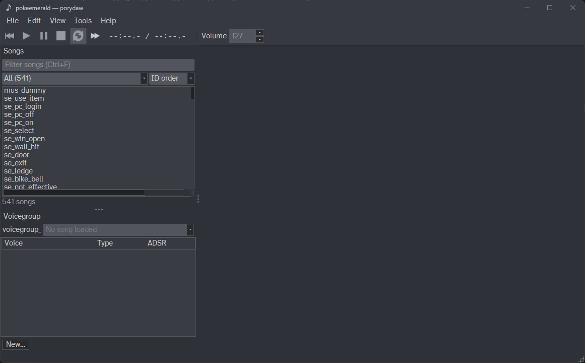
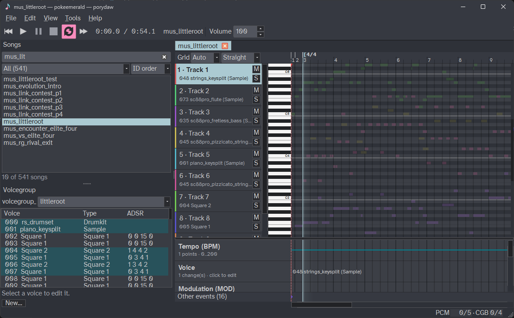
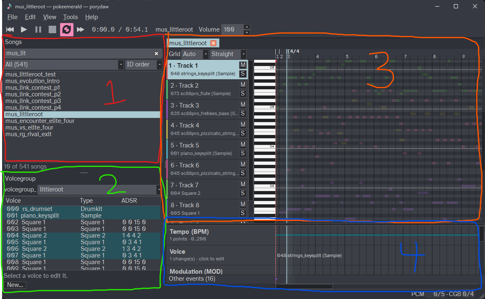
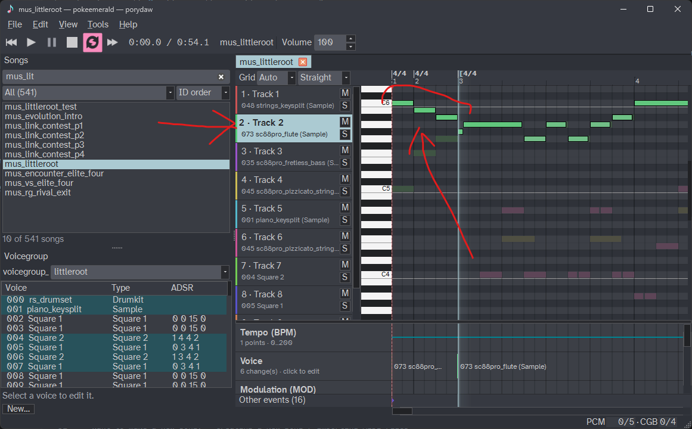

# Quick Start

This is a quick 10-minute walkthrough of a basic music edit using Porydaw.  We'll change a note in Littleroot Town's song and hear it in-game.

## 1. Open your project

Chose `File → Open Project`, and pick the folder for your decomp project. I've chosen my `pokeemerald` folder here.

We can see the song list in the left side of the window.  There are 541 total songs in pokeemerald.

## 2. Play a song

Let's open Littleroot Town's song so we can edit it. Either scroll or use `Ctrl+F` to search for `mus_littleroot`. Double-click on `mus_littleroot` to open it.

Press `Spacebar` to play/pause the song (or click the buttons in the top-left of the window). It sounds just like it does in-game. That's the magic of Porydaw!

## 3. Look around

Porydaw has several main panels. They are all resizable and can even be repositioned by dragging on each of their header areas.

1. **Song list**: All the songs are listed here. You can filter and order it.
2. **Voicegroup editor**: Displays all of the instruments used in the current song's voicegroup. Also allows editing!
3. **Piano roll**: View and edit the MIDI notes.
4. **Automation lanes**: View and edit the "effects" (MIDI CC events).

## 4. Edit a note

Now, let's actually edit some notes!  I'm going to edit the first three notes that the Flute plays at the very start of the song.  To do that:

1. Select the flute's track by clicking on it.
    - In this case, it's Track 2--I can see it's using the `sc88pro_flute` instrument.
2. Adjust zoom level with mouse scroll wheel, and pan around with click-dragging the *middle* mouse button so I can see the notes.
3. Click on the notes and drag them around.
4. Play the song (with `Spacebar`) and adjust until I'm satisfied with how it sounds.
    - `Ctrl+Z` and `Ctrl+Shift+Z` to undo/redo any edits.

In my case, I changed those three intro flute notes to descend from the C6 note.

## 5. Save

To save the song's changes, `Ctrl+S` (or `File → Save Song`). Porydaw directly saves those changes to `mus_littleroot.mid` in your decomp project.

## 6. Hear it in-game

Now, we're ready to hear it in-game.  Simply compile the game like you normally would via `make` and listen to the song in-game and confirm you hear the changes!

## Where to next

Now that you've gotten your feet wet, where should you go next?

- New to music software (DAWs): [Music & DAW Basics](./daw-basics.md)
- Want to make a new song: [Creating a New Song](../manual/new-song.md) or [Importing MIDI Files](../manual/midi-import.md)
- Want to create new instruments: [Instruments & Voicegroups](../manual/voicegroups.md)
