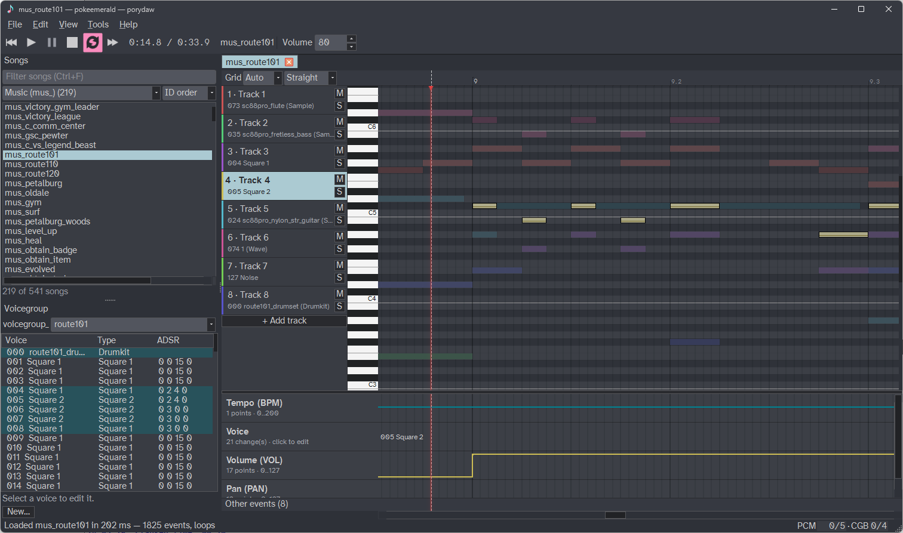

# Introduction

!!! danger
    This documentation is under construction and still being filled out!

## What is Porydaw?

Porydaw is an all-in-one music editor for the Gen 3 Pokémon decompilation projects ([pokeruby][pokeruby], [pokeemerald][pokeemerald], and [pokefirered][pokefirered]).

Porydaw accurately mimics the games' m4a sound engine, so _what you hear in Porydaw is what you'll hear in game_. Before Porydaw existed, modifying/inserting music and sound effects into the game required lots of tiresome tweaking and testing in-game until eventually it sounded good (or at least _good enough_).  With Porydaw, editing music is pain-free!

It reads and writes directly to your decomp project's files.  It's seamless, and there is no need to juggle several different audio-related programs.

## Who is it for?

1. Absolute beginners with music
    - You don't need to know music theory or have ever used a "DAW" program before. For example, if you simply want to import some MIDI songs, Porydaw has you covered.
    - See [Music & DAW Basics](getting-started/daw-basics.md) to learn the basics.
2. Sappy / Anvil Studio ROM hacking veterans:
    - You already know most of the ins and outs of Gen 3 Pokémon music insertion, but you hate having to use Sappy and/or Anvil Studio.
    - Porydaw completely replaces those old workflows.
3. Power users and composers:
    - You are very comfortable with existing DAWs (Reaper, FL Studio, Ableton, etc.) and might not want to leave them.
    - Porydaw has many of the table-stakes editing/composition features and hotkeys.
        - Notably, it doesn't _currently_ have support for MIDI recording, so notes must be entered by hand.
    - If you absolutely can't bring yourself to compose music directly in Porydaw, the [poryaaaa CLAP plugin](https://github.com/huderlem/poryaaaa/releases) is available for use in any DAW that supports CLAP plugins.

## What can it do?

- Play any song in your Gen 3 Pokémon decomp project with high-quality audio accuracy by emulating the m4a sound engine.
- Edit notes and MIDI events in a piano roll with live audition.
- Create brand-new songs.
- Import existing MIDI files.
- Edit voicegroups (and instruments) with live preview of every voice.
- Create your own instruments/samples by importing .sf2/.wav/.mp3/.ogg files.
    - Use the built-in loop finder to create smooth looped instruments.
- Full undo/redo support.

## Getting help

For support, feature requests, reporting bugs, etc., the best places to reach out are:

- Create an issue on Porydaw's GitHub page: https://github.com/huderlem/porydaw
- Visit the `#porydaw` channel in the [pret Discord server](https://discord.gg/d5dubZ3).

[pokeruby]: https://github.com/pret/pokeruby
[pokeemerald]: https://github.com/pret/pokeemerald
[pokefirered]: https://github.com/pret/pokefirered
