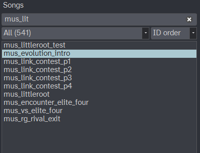

# The Main Window

## Overview

Porydaw has several main panels. They are all resizable and can even be repositioned by dragging on each of their header areas.

1. **Song list**: All the songs are listed here. You can filter and order it.
2. **Voicegroup editor**: Displays all of the instruments used in the current song's voicegroup. Also allows editing!
3. **Piano roll**: View and edit the MIDI notes.
4. **Automation lanes**: View and edit the "effects" (MIDI CC events).

## The song list

All of the project's songs are listed in the song list. This includes sound effects. It supports filtering by prefix, as well as ordering by ID or alphabetical. Use `Ctrl+F` to type and search for song names.

To open a song, double-click on an item.

The right-click menu allows:

- `Open Song`
- `Open Song in New Tab`
    - You can have multiple songs open in different Porydaw tabs!
- `Register Song` (writes any missing file changes to the decomp project)
- `Delete Song`
    - This deletes the song from the standard locations, but it doesn't fully delete all references to the song from e.g. scripts or C code.

## Track headers

Track headers appear to the left of the piano roll. They display the track name, its current instrument/voice, mute and solo buttons. Click on a track to focus it. When focused, its notes and MIDI events can be edited in the piano roll area.

See [Working with Tracks](tracks.md) for more details.

## The piano roll

<!-- TODO: Timeline, grid, loop region markers, edit cursor vs. playhead.
Editing details in [Editing Notes](piano-roll.md). -->

## The transport bar

<!-- TODO: Play/pause/stop, loop toggle, follow-playhead toggle, position
and tempo display, master volume, polyphony meter (link to
[Polyphony](polyphony.md) for what the meter means). -->

## Automation lanes

<!-- TODO: The bottom strip; per-track lanes + the tempo lane. Details in
[Automation](automation.md). -->

## The voicegroup dock

<!-- TODO: The current song's instrument list; click to audition. Details in
[Instruments & Voicegroups](voicegroups.md). -->

## Working with multiple songs (tabs)

<!-- TODO: Open in New Tab, switching, per-tab dirty state, Close Tab. -->

## Navigation cheat-sheet

<!-- TODO: Scroll/zoom gestures (wheel, modifiers), jumping the playhead,
following playback. Full key list in [Keyboard Shortcuts](shortcuts.md). -->
